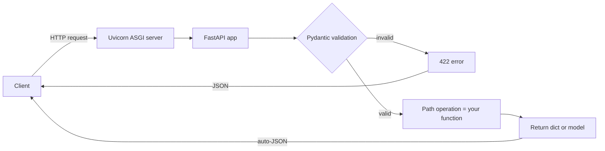

# 01 — FastAPI Basics for AI Services

> Phase 1 · Module 1.1 · Lesson 1 · `[JD VERIFIED — 82%]`

## 🗺️ Stage 0 — Concept Map

To put an AI model behind a web address your app (or a website) can call, you need a **web
framework**. **FastAPI** is the one ~82% of AI job posts name. This lesson is your first FastAPI
service; it sets up everything later in Phase 1 — streaming (lesson 04), provider calls (Module
1.2), the gateway milestone. It builds directly on the Python you learned in Phase 0 (async,
Pydantic, type hints).

## 🔑 New Terms (plain English)

- **Web framework** — a library for building a web **API** (a service other code calls over HTTP).
- **FastAPI** — a modern, fast Python web framework built on **Starlette** (web parts) + **Pydantic**
  (data validation).
- **Path operation** — one URL + HTTP method handled by one function (e.g. `GET /health`).
- **Endpoint / route** — another word for a path operation.
- **ASGI server** — the program that actually runs the app and serves requests (**Uvicorn**).
- **OpenAPI / Swagger UI** — an auto-generated, interactive docs page for your API (`/docs`).
- **HTTP verb / method** — `GET` (read), `POST` (send data / act), `PUT`/`PATCH` (update), `DELETE` (remove).
- **`async def` vs `def` handler** — async for awaiting I/O (LLM calls); a sync `def` runs in a threadpool.
- **`Query()` / `Path()` / `Field()`** — attach validation constraints (`ge`, `le`, `min_length`) to inputs.
- **Status code** — the 3-digit result: `200` ok, `201` created, `422` validation error.

## 🎈 Stage 1 — The Simple Idea (analogy: a restaurant with an auto-written menu)

FastAPI is a restaurant where you just describe each dish (a Python function + its types) and the
restaurant **auto-prints the menu, checks every order for mistakes, and serves it fast**. You write
a normal Python function and put a one-line label with the URL just above it (a *decorator*, e.g.
`@app.get("/health")`); FastAPI then handles reading the request, checking it for mistakes (via
Pydantic), turning your return value into JSON, and even writing the interactive docs — all from your
type hints.

**The "Aha!":** you write plain typed Python functions; FastAPI turns them into a validated,
documented web API for free. Your Phase 0 Pydantic + async knowledge *is* FastAPI knowledge.

**💢 Without a framework (the old/painful way)** — to expose one endpoint you'd hand-write the HTTP
plumbing: read the raw request body, `json.loads` it, manually check every field's type, build the
error response, `json.dumps` the result, and hand-write the API docs. FastAPI generates all of that
from your type hints.

### 📊 Diagram — the request lifecycle



FastAPI does everything between the two ends — validate, route, and serialise — **from your type hints**.

## ⚙️ Stage 2 — How It Actually Works

### 2.1 Install, the app object, and running it

```powershell
python -m venv .venv
.\.venv\Scripts\Activate.ps1
pip install "fastapi[standard]"     # includes Uvicorn (the ASGI server) + the `fastapi` CLI (quote it!)
```

```python
# main.py
from fastapi import FastAPI

app = FastAPI()                      # the application object — everything hangs off this

@app.get("/health")                  # a PATH OPERATION: HTTP GET at the URL "/health"
def health():                        # the handler function
    return {"status": "ok"}          # a dict -> FastAPI converts it to JSON automatically
```

**Variation — `fastapi dev` vs `fastapi run` (which to use when):**
- `fastapi dev main.py` — **development**: auto-reloads on save. Use while coding.
- `fastapi run main.py` — **production**: no reload, tuned defaults. Use in Docker (lesson 09).

Visit `/health` → `{"status":"ok"}`, and `/docs` for the **auto-generated interactive docs**.

### 2.2 Path operations & HTTP verbs — and when to use each

One function = one URL + one HTTP method. **Key features:** auto JSON, auto docs, auto validation.

```python
@app.get("/models")          # GET    — READ data (no body)
@app.post("/chat")           # POST   — SEND data / trigger an action (has a body)  <- most LLM calls
@app.put("/config/{id}")     # PUT    — REPLACE a resource wholesale
@app.patch("/config/{id}")   # PATCH  — partially update a resource
@app.delete("/chats/{id}")   # DELETE — remove a resource
```

**Use which:** for AI services you'll mostly use **POST** (send a prompt/config in the body) and
**GET** (health, list models, fetch a saved chat). PUT/PATCH/DELETE appear once you store conversations.

### 2.3 Three ways to take input — path vs query vs body

```python
from fastapi import Query, Path

@app.get("/chats/{chat_id}/messages")        # PATH param: which resource (required)
def list_messages(
    chat_id: int = Path(ge=1),               # validate: must be >= 1
    limit: int = Query(20, le=100),          # QUERY param ?limit=: an option/filter (optional, capped)
):
    ...
```

- **Path** (`/{chat_id}`) — *which* resource you're addressing; always required.
- **Query** (`?limit=20`) — *options/filters*; optional, with defaults.
- **Body** (Pydantic, next) — *structured data you send* (the prompt, settings).

**Use which:** identity → path; tweaks/filters → query; rich payloads → body. `Query()`/`Path()` add
constraints (`ge`, `le`, `min_length`) so bad input is rejected with a **422** before your code runs.

### 2.4 Pydantic request & response models (the AI boundary)

For an LLM request you declare a **Pydantic model** (Phase 0 lesson 13). FastAPI validates incoming
JSON against it (bad data → 422), and `response_model` validates/shapes what you return:

```python
from pydantic import BaseModel, Field

class ChatRequest(BaseModel):            # the SHAPE of the request body
    message: str
    temperature: float = Field(0.0, ge=0, le=2)   # validated range, auto-documented in /docs

class ChatResponse(BaseModel):           # the SHAPE of the response
    reply: str

@app.post("/chat", response_model=ChatResponse)
async def chat(req: ChatRequest) -> ChatResponse:   # async: ready for slow LLM calls (Module 1.2)
    return ChatResponse(reply=f"You said: {req.message}")   # validated in, validated out
```

`response_model` doubles as your API **contract** (it appears in `/docs`) and **strips extra fields**
you didn't promise — handy when returning trimmed LLM output.

### 2.5 `async def` vs `def` — the handler choice that matters most for AI

This is the single most important FastAPI decision for AI services. "I/O" just means *waiting on
something outside your code* — an LLM API reply, a database, another web call.

**Option A — `async def` (the default for AI handlers)**
- **Key features:**
  - Lets one worker start a slow call and then *go serve other requests while it waits* (handle many at once).
  - Pairs with `await` and async clients (the LLM SDKs all ship async versions).
  - This juggling of many waits at once is *the* reason FastAPI fits AI work.
- **✅ Use when:** your handler `await`s anything slow — an LLM call, a database, an HTTP request.
- **🚫 Avoid when → use a plain `def`:** the work is heavy number-crunching, or the library has no
  async version (nothing to `await`) → a sync `def` is the safer pick.
- **⚠️ Gotcha:** doing *blocking* work inside an `async def` (a sync HTTP call, `time.sleep`) freezes
  the **event loop** — the one loop that takes turns running all the async work — and stalls *every*
  other request.

**Option B — `def` (plain / sync handler)**
- **Key features:**
  - FastAPI runs it in a **threadpool** — a small set of background worker threads — so it won't block
    the server.
  - The simplest choice for ordinary code that doesn't wait on anything.
- **✅ Use when:** the work is CPU-heavy, or you must call a library that has no async (`await`) API.
- **🚫 Avoid when → use `async def`:** the handler mostly *waits* on I/O (LLM/DB) — `async def` serves far
  more of those at the same time.
- **⚠️ Gotcha:** very long CPU work can still use up every thread in the pool under load — move it to a
  background task or queue (lesson 07).

```python
@app.post("/chat")
async def chat(req: ChatRequest):
    reply = await call_llm(req.message)   # await the slow LLM call -> server stays responsive
    return {"reply": reply}
```

### 2.6 Status codes (brief)

Default is `200`. Set another with `status_code=`; raise others with `HTTPException` (lesson 03):

```python
@app.post("/chats", status_code=201)      # 201 Created
def create_chat(): ...
```

The `/docs` page now shows the `ChatRequest`/`ChatResponse` schemas automatically.

> 🔬 **Under the hood:** at startup FastAPI reads each handler's **type hints**, builds a **Pydantic
> model** for the inputs, and registers the function in a **routing table** keyed by path + method. Per
> request, Uvicorn (the ASGI server) matches the route, Pydantic checks and converts the body to the
> right types (bad data → auto-`422`), your function runs, and the return value is turned into JSON
> text. Those same type hints
> also generate the **OpenAPI schema** behind `/docs`.

## 🚀 Stage 3 — In Practice / Why It Matters

FastAPI is the AI-services standard precisely because of three Phase-0 things it builds on:
**async** (handle many slow LLM calls at once), **Pydantic** (validate untrusted input/LLM output
at the boundary), and **auto OpenAPI docs** (instant, shareable API contract). Every later Phase 1
lesson — streaming, multi-provider calls, the gateway — is "this, plus one more thing."

## ⚖️ Variations & When to Use

| Decision | Options | Use which |
| --- | --- | --- |
| **Handler type** | `async def` vs `def` | **`async def`** when you `await` I/O (LLM/DB calls); **`def`** for blocking/CPU work (runs in a threadpool). **Never block inside `async def`.** |
| **HTTP verb** | GET / POST / PUT / PATCH / DELETE | **GET** to read, **POST** to send a prompt/action, PUT/PATCH/DELETE to manage stored resources |
| **Input location** | path vs query vs body | **path** = which resource · **query** = options/filters · **body** (Pydantic) = structured payload |
| **Run command** | `fastapi dev` vs `fastapi run` | **dev** (auto-reload) while coding · **run** in production/Docker |

## 🐛 Common Errors & Fixes

| What you see | Cause | Fix |
| --- | --- | --- |
| `'fastapi' is not recognized` | `fastapi[standard]` not installed / venv inactive | Activate venv; `pip install "fastapi[standard]"` (with quotes) |
| `422 Unprocessable Entity` | Request didn't match the type/model | Send the right JSON shape; check `/docs` for the schema |
| Body always empty / 422 on POST | Used `GET`, or no Pydantic model param | Use `@app.post` and a `BaseModel` parameter |
| Edits don't take effect | Server not reloading | Run `fastapi dev main.py` (auto-reload), and save the file |
| `RuntimeError: ... blocking` / slow under load | Did blocking work in an `async def` | `await` async calls, or use a sync `def` handler (Phase 0 L14) |

## 📌 Quick Reference

```python
from fastapi import FastAPI, Query, Path
from pydantic import BaseModel, Field
app = FastAPI()

@app.get("/health")                       # GET = read (no body)
def health(): return {"status": "ok"}

@app.get("/chats/{id}")                   # path (which) + query (options), auto-validated
def get(id: int = Path(ge=1), limit: int = Query(20, le=100)): ...

class Req(BaseModel): message: str; temperature: float = Field(0, ge=0, le=2)
@app.post("/chat", response_model=Resp)   # POST = send data; response_model = the contract
async def chat(req: Req) -> Resp: ...      # async def -> await the LLM call
```
- Run: `fastapi dev` (reload) / `fastapi run` (prod). Inputs from **type hints**; bodies from **Pydantic**; bad input → **422**.
- **`async def`** when you `await` I/O (LLM calls); **`def`** for blocking work (threadpool). **Never block in `async def`.**

> 🎯 **Interview angle:** "Why FastAPI for AI services?" → async-first (concurrent slow LLM calls),
> Pydantic validation at the boundary, and automatic OpenAPI docs — all from Python type hints.

## 🛑 STOP — Self-Check

You need an endpoint that receives `{"message": "...", "temperature": 0.2}` and returns a reply.
Which HTTP method and which FastAPI feature validate the incoming JSON, and what happens if the
client sends `temperature` as `"hot"`?

<details><summary>Answer</summary>

Use **`POST`** (it carries a body) with a **Pydantic `BaseModel`** parameter — FastAPI validates the
JSON against that model. If `temperature` arrives as `"hot"`, it can't be coerced to `float`, so
FastAPI rejects the request automatically with a **`422 Unprocessable Entity`** and a clear message
naming the bad field — the bad data never reaches your code.
</details>
