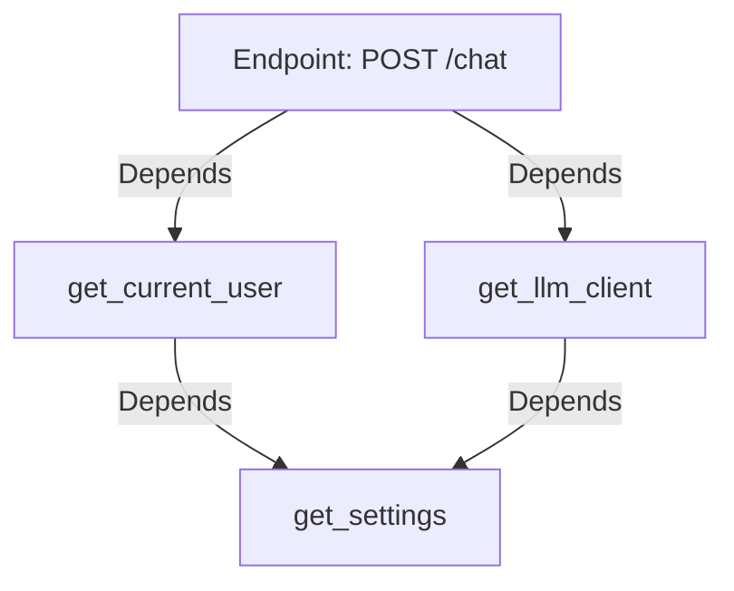

# 02 — Dependency Injection

> Phase 1 · Module 1.1 · Lesson 2 · `[JD VERIFIED — core FastAPI]`

## 🗺️ Stage 0 — Concept Map

Real AI services reuse the same things in many endpoints: the **LLM client**, **settings/API
keys**, a **database session**, **auth**. FastAPI's **Dependency Injection (DI)** is the clean way
to provide those without copy-pasting setup into every handler. It builds on [01](01%20FastAPI%20Basics%20for%20AI%20Services.md)
and is used in nearly every FastAPI codebase (and a common interview topic).

## 🔑 New Terms (plain English)

- **Dependency** — a function that produces something an endpoint needs (a client, a user, config).
- **`Depends(...)`** — the marker that tells FastAPI "call this dependency and pass me its result."
- **Dependency Injection** — FastAPI *calls the dependency for you* and hands the result into your
  handler, instead of the handler building it itself.
- **`yield` dependency** — a dependency that does setup, hands over a value, then runs cleanup after
  the request (e.g. open/close a DB session).
- **Sub-dependency** — a dependency that itself depends on another dependency.
- **`Annotated[T, Depends(...)]`** — the modern, reusable way to declare an injected type once.
- **Class dependency** — a class used as a dependency; its `__init__` params become the inputs.
- **`dependencies=[...]`** — attach a dependency for its **side-effect only** (auth/rate-limit), no value returned.

## 🎈 Stage 1 — The Simple Idea (analogy: a kitchen prep station)

In a busy kitchen, chefs don't each run to the pantry — a **prep station** hands them ready
ingredients. FastAPI DI is that prep station: you write *how to make* a thing once (a dependency
function), and FastAPI **injects** it into any endpoint that asks for it.

**The "Aha!":** you declare what an endpoint *needs* as a parameter; FastAPI builds it and passes it
in. One definition, reused everywhere, and trivially swappable in tests.

**💢 The old/painful way** — without DI you create the model client as a **global**, or rebuild it
inside every handler, and thread shared objects through every function call by hand. That's awkward
to configure once and almost impossible to swap for a fake in tests. DI lets FastAPI build and inject
these for you.

### 📊 Diagram — the dependency graph



FastAPI walks this graph, builds each dependency for you, and **caches** `get_settings` so it runs **once
per request** even though two dependencies need it.

## ⚙️ Stage 2 — How It Actually Works

### 2.1 A dependency is just a callable (and 3 forms)

A **dependency** is just a *callable* — anything you can call like a function — that produces
something your endpoint needs.

```python
from fastapi import FastAPI, Depends

app = FastAPI()

def get_settings():                       # a dependency is just a function you can call
    return {"model": "gpt-4o-mini"}       # (real apps return a Pydantic Settings object)

@app.get("/config")
def config(settings: dict = Depends(get_settings)):   # "inject the result of get_settings here"
    return settings                       # FastAPI called get_settings() and passed it in
```

Dependencies come in **three forms** — pick by what you need:

**Form A — Function dependency (the default, ~90% of cases)**
- **Key features:**
  - A plain function that *returns a value* (settings, a client, the current user).
  - The easiest form to read, test, and reuse.
- **✅ Use when:** you just need to build a value and hand it back.
- **🚫 Avoid when → use a sibling:** you need to bundle several related inputs together → use a
  **class** (Form B); or you must clean a resource up afterwards → use a **`yield`** dependency (Form C).
- **⚠️ Gotcha:** pass the function *itself* — `Depends(get_x)`, **no parentheses** — or FastAPI can't
  call it for you.

**Form B — Class dependency (bundle related inputs/state)**

```python
class Pagination:
    def __init__(self, limit: int = 20, offset: int = 0):
        self.limit, self.offset = limit, offset

@app.get("/items")
def items(p: Pagination = Depends(Pagination)):   # limit/offset come from the query string
    return {"limit": p.limit, "offset": p.offset}
```

- **Key features:**
  - The class's `__init__` parameters are filled in for you (from the query string, path, or body).
  - Groups a related cluster of options (pagination, filters) into one reusable object.
- **✅ Use when:** several endpoints share the same group of parameters or state.
- **🚫 Avoid when → use a function:** you only need a single value — a class is extra ceremony for that.
- **⚠️ Gotcha:** write `Depends(Pagination)` (the class itself) — don't create the object yourself.

**Form C — `yield` dependency (a resource that must be cleaned up)**
- **Key features:**
  - Does setup, hands over a value, then runs cleanup *after* the response — even if the request errored.
  - Built for things you must open and then close.
- **✅ Use when:** the dependency opens a resource — a database session, a file, a network connection.
- **🚫 Avoid when → use a function:** there's nothing to release (just a plain value) — `return` is simpler.
- **⚠️ Gotcha:** put the cleanup in a `try/finally` so it still runs if the endpoint raises (full
  example in 2.4).

### 2.2 The modern `Annotated` form (recommended)

Repeating `= Depends(...)` in every signature gets noisy. Define the injected type **once** and reuse:

```python
from typing import Annotated

SettingsDep = Annotated[Settings, Depends(get_settings)]   # name the injected type once

@app.get("/config")
def config(settings: SettingsDep):        # reuse the alias anywhere — no repetition, type-checked
    return settings
```

This is the current FastAPI-recommended style; you'll see both forms in the wild.

### 2.3 The real AI use: a shared LLM client + settings (sub-dependencies + caching)

```python
from functools import lru_cache
from pydantic_settings import BaseSettings   # from Phase 0.1 lesson 13

class Settings(BaseSettings):                # reads OPENAI_API_KEY etc. from the environment
    openai_api_key: str
    model: str = "gpt-4o-mini"

@lru_cache                                   # build Settings ONCE, reuse across all requests
def get_settings() -> Settings:
    return Settings()

def get_llm_client(settings: Settings = Depends(get_settings)):   # a SUB-DEPENDENCY (a dep needs a dep)
    return build_openai_client(settings)     # (Module 1.2)

@app.post("/chat")
async def chat(client = Depends(get_llm_client)):   # the client is injected, ready to use
    return {"using": client}
```

**Two layers of caching:** FastAPI **caches a dependency's result within one request** by default (if
two sub-deps both need `get_settings`, it runs once per request). **`@lru_cache`** extends that to
**across all requests** — one shared instance reused everywhere (a *singleton*), ideal for expensive
things that don't change between requests (settings, clients).

### 2.4 `yield` dependencies — setup + guaranteed cleanup

```python
def get_db():
    db = open_session()        # setup (runs before the endpoint)
    try:
        yield db               # hand the db to the endpoint
    finally:
        db.close()             # cleanup (runs AFTER the response is sent) — even if it errored
```

**`yield` vs `return`:** use `return` for a plain value; use **`yield`** when there's a **resource to
release** (DB session, file, network client) — the cleanup is guaranteed after the response.

### 2.5 Where to attach a dependency (scope) — the when-to-use map

```python
# 1) As a PARAMETER — when you need the VALUE in the handler:
def chat(client = Depends(get_llm_client)): ...

# 2) In the DECORATOR — when you only need it to RUN (side-effect, no value), e.g. auth/rate-limit:
@app.post("/chat", dependencies=[Depends(require_api_key)])   # lesson 06
async def chat(): ...

# 3) On a ROUTER — apply to every route in a feature (lesson 05):
router = APIRouter(dependencies=[Depends(require_api_key)])

# 4) On the WHOLE APP — apply globally:
app = FastAPI(dependencies=[Depends(require_api_key)])
```

### 2.6 Why it's great for tests: overrides

```python
# Swap a dependency without touching the endpoint code:
app.dependency_overrides[get_settings] = lambda: Settings(openai_api_key="test", model="fake")
```

> 🔬 **Under the hood:** FastAPI reads each handler's `Depends(...)` parameters, builds a **dependency
> graph** (a map of which dependency needs which), and resolves it per request — running each dependency
> once per request so it isn't rebuilt twice. Because every node is just a function, tests can swap any
> one via `app.dependency_overrides[real] = fake` with no fragile patching of internals.

## 🚀 Stage 3 — In Practice / Why It Matters

DI is how production AI services share the **LLM client**, **config/secrets**, **auth**, and **DB
sessions** cleanly. It centralises setup (change the model in one place), makes endpoints readable
(they just declare what they need), and makes testing easy (override the LLM with a fake). You'll
inject the multi-provider client (Module 1.2) and a rate limiter (later) exactly this way.

## ⚖️ Variations & When to Use

| Decision | Options | Use which |
| --- | --- | --- |
| **Dependency form** | function / class / `yield` | **function** = produce a value (default) · **class** = bundle related params/state · **`yield`** = a resource needing cleanup |
| **How to attach** | `Depends()` as a **param** vs `dependencies=[...]` in the **decorator** | **param** when you need the **value**; **decorator** when you only need it to **run** (auth, rate-limit, logging) |
| **Caching** | per-request (default) vs `@lru_cache` (app-wide) | default for normal deps; **`@lru_cache`** for expensive, stateless singletons (settings, LLM client) |
| **Syntax** | `= Depends(...)` vs `Annotated[T, Depends(...)]` | prefer **`Annotated`** (define once, reuse) in new code |

## 🐛 Common Errors & Fixes

| What you see | Cause | Fix |
| --- | --- | --- |
| Dependency function never runs | Passed `Depends(get_x())` (called it) | Pass the function itself: `Depends(get_x)` (no parentheses) |
| `AttributeError` on the injected value | Returned the function, not its result | Let FastAPI call it via `Depends`; don't call it yourself |
| Resource never closed (leaks) | Used `return` for a resource | Use a **`yield`** dependency with `try/finally` |
| New client built on every request (slow) | No caching | Cache app-wide things with `@lru_cache` |
| Test can't fake the LLM | Client created inside the handler | Inject it via `Depends`, then use `app.dependency_overrides` |

## 📌 Quick Reference

```python
from fastapi import Depends
from typing import Annotated

def dep(): return value
def handler(v = Depends(dep)): ...               # inject the VALUE (or: v: Annotated[T, Depends(dep)])

def get_db():                                    # setup + cleanup
    db = open()
    try: yield db
    finally: db.close()

@lru_cache                                       # build once, reuse app-wide (settings/clients)
def get_settings() -> Settings: return Settings()

@app.get("/x", dependencies=[Depends(check)])    # run-only (auth/rate-limit); no value returned
app.dependency_overrides[dep] = fake             # swap in tests
```
- **Need the value?** `Depends` as a param (prefer `Annotated`). **Only need it to run?** `dependencies=[...]`.
- `yield` for cleanup · `@lru_cache` for shared singletons · overrides for tests.

> 🎯 **Interview angle:** "How do you share an LLM client across FastAPI endpoints?" → a
> dependency (`Depends(get_client)`), often `@lru_cache`-d, so it's built once, injected everywhere,
> and overridable in tests.

## 🛑 STOP — Self-Check

Why inject the LLM client via `Depends(get_llm_client)` instead of creating `OpenAI()` inside each
endpoint function?

<details><summary>Answer</summary>

Because injecting it (1) **centralises** setup — you configure the client/model once and change it
in one place; (2) **avoids rebuilding** it on every request (especially with `@lru_cache`), which is
faster; (3) keeps endpoints **clean and readable** (they just declare what they need); and (4) makes
**testing easy** — you swap the real client for a fake via `app.dependency_overrides` without
touching the endpoint code. Creating `OpenAI()` inline duplicates setup and is hard to test.
</details>
