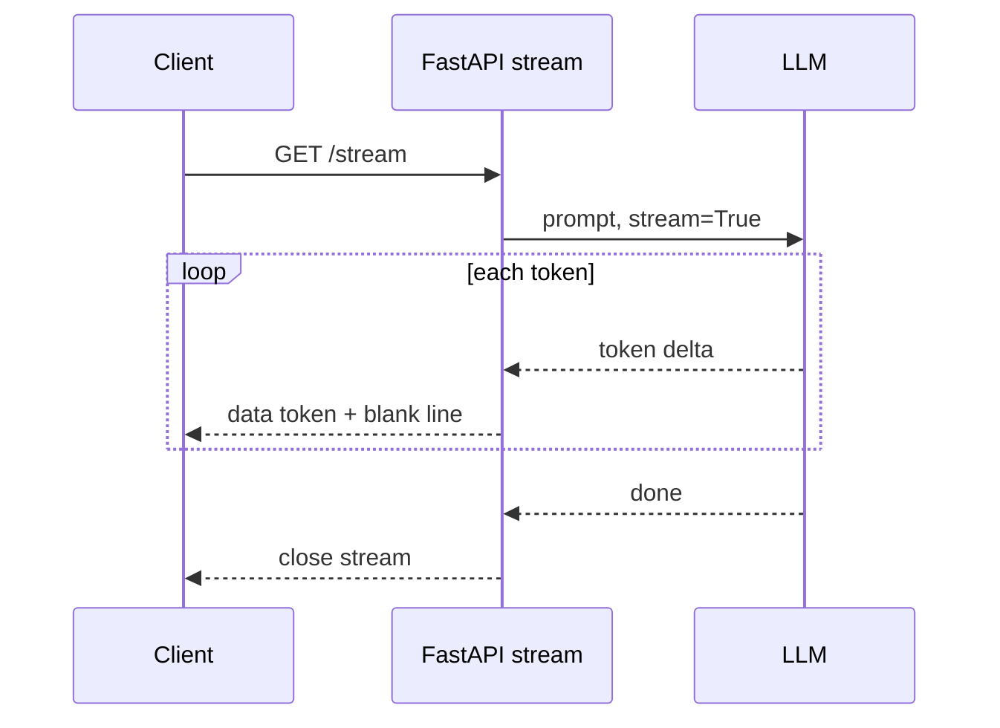

# 04 — Streaming with SSE

> Phase 1 · Module 1.1 · Lesson 4 · `[JD VERIFIED — 82%]`

## 🗺️ Stage 0 — Concept Map

An LLM takes several seconds to write a full answer. Instead of making the user stare at a spinner,
you **stream** the reply word-by-word as it's generated — the "ChatGPT typing" effect. This lesson
is how to do that in FastAPI with **Server-Sent Events (SSE)**. It builds on [01](01%20FastAPI%20Basics%20for%20AI%20Services.md),
Phase 0.1 **generators** (lesson 08) and **async** (lesson 14), and sets up real token streaming
from providers in Module 1.2.

## 🔑 New Terms (plain English)

- **Streaming** — sending the response in pieces as they're ready, instead of all at once at the end.
- **Server-Sent Events (SSE)** — a simple standard for a server to push a one-way stream of text
  events to a client over a normal HTTP connection.
- **`StreamingResponse`** — FastAPI's response type that sends an **async generator's** chunks as
  they're produced.
- **Event / `data:` line** — one SSE message; its format is `data: <payload>\n\n` (note the blank line).
- **Time-to-first-token** — how long until the user sees the *first* word (streaming makes this tiny).
- **`event:` / `id:` / `retry:`** — optional SSE fields: event name · message id (reconnection) · reconnect delay.
- **Heartbeat / keep-alive** — a periodic comment (`: ping`) that stops idle proxies closing the stream.
- **Client disconnect** — the browser dropping the connection; detect it (`request.is_disconnected()`) to stop generating (save cost).
- **`sse-starlette`** — a library (`EventSourceResponse`) that formats SSE and handles heartbeats/disconnects.

## 🎈 Stage 1 — The Simple Idea (analogy: a ticker tape vs. a sealed letter)

A normal response is a **sealed letter**: you wait until the whole thing is written, then it's
delivered all at once. Streaming is a **ticker tape**: each word is printed and sent the instant
it's ready, so the reader starts reading immediately. For a slow LLM, the ticker tape feels far
faster even though the total time is the same.

**The "Aha!":** you hand FastAPI an **async generator** that `yield`s pieces; FastAPI forwards each
piece to the client the moment it's produced — no waiting for the whole answer.

**💢 The old/painful way (no streaming)** — you `await` the whole answer, then return one big string,
so the user stares at a spinner for the full 5–10s. Streaming sends each token the instant it's
produced.

### 📊 Diagram — the streaming sequence



Each token is forwarded the moment it's produced — so **time-to-first-token** is tiny even though total time is the same.

## ⚙️ Stage 2 — How It Actually Works

### 2.1 A streaming endpoint

```python
import asyncio
from fastapi import FastAPI
from fastapi.responses import StreamingResponse

app = FastAPI()

# An ASYNC GENERATOR (Phase 0.1 lessons 08 + 14): yields chunks one at a time.
async def token_stream(message: str):
    for word in message.split():
        await asyncio.sleep(0.2)          # pretend each token takes time (like an LLM)
        # SSE format: every event is "data: <payload>" followed by a BLANK line.
        yield f"data: {word}\n\n"

@app.get("/stream")
async def stream(message: str = "Hello from a streaming AI service"):
    # StreamingResponse sends each yielded chunk immediately, as it's produced.
    return StreamingResponse(token_stream(message), media_type="text/event-stream")
```

Run it (`fastapi dev main.py`) and watch it stream with **curl** (`-N` turns off buffering — holding
data back until it's all ready — so you see chunks arrive live):

```powershell
curl -N "http://127.0.0.1:8000/stream"
# data: Hello
# data: from
# data: a
# ...
```

### 2.2 The SSE message format — more than just `data:`

Each event is a `data:` line ended by a **blank line** (`\n\n`), plus `media_type="text/event-stream"`.
SSE also has optional fields you'll use for production streams:

```text
event: token            # (optional) a NAMED event type the client can listen for
id: 42                  # (optional) a message id — the browser resends it as Last-Event-ID on reconnect
data: Hello             # the payload (the data: line can repeat for multiline)
retry: 3000             # (optional) tell the client to wait 3s before reconnecting
                        # <- the BLANK line ends the event
: ping                  # a COMMENT line (starts with ':') — ignored; used as a heartbeat (see 2.5)
```

The minimum for an LLM stream is `data: <text>\n\n` + the media type; the rest are opt-in.

### 2.3 Where the LLM plugs in (preview of Module 1.2)

Today we faked tokens with `message.split()`. With a real provider you'll iterate the model's own
stream and yield each piece:

```python
# Module 1.2 shape — iterate the LLM's streamed chunks and forward them as SSE:
async def llm_stream(prompt: str):
    async for chunk in client.responses.create(model="gpt-4o-mini", input=prompt, stream=True):
        yield f"data: {extract_text(chunk)}\n\n"
    yield "data: [DONE]\n\n"          # optional end marker (a "sentinel" = a value meaning "stream over"), OpenAI-style
```

### 2.4 Stop work when the client disconnects (this saves real money)

If the user closes the tab mid-answer, **stop generating** — otherwise you keep paying the LLM for
tokens nobody will read. Check for disconnect between chunks:

```python
from fastapi import Request

@app.get("/stream")
async def stream(request: Request, prompt: str):
    async def gen():
        async for piece in llm_stream(prompt):
            if await request.is_disconnected():   # client gone?
                break                             # stop the LLM loop — no more billed tokens
            yield piece
    return StreamingResponse(gen(), media_type="text/event-stream")
```

### 2.5 Heartbeats / keep-alive (for long streams)

A long pause (the model "thinking") can let a **proxy or load balancer** (middle-men between the user
and your server) **kill an idle connection**. Send a periodic **comment** line to keep it warm:

```python
yield ": ping\n\n"     # a comment event — the client ignores it, but the connection stays alive
```

### 2.6 Variation — raw `StreamingResponse` vs `sse-starlette`

Hand-formatting `data: …\n\n`, heartbeats, and disconnects gets repetitive. The **`sse-starlette`**
library's `EventSourceResponse` does it for you:

```python
# pip install sse-starlette
from sse_starlette.sse import EventSourceResponse

@app.get("/stream")
async def stream():
    async def gen():
        async for piece in llm_stream(prompt):
            yield {"data": piece}        # yield dicts; the library formats + heartbeats + handles disconnect
    return EventSourceResponse(gen())
```

This is a real choice, so weigh both:

- **Raw `StreamingResponse` (built-in)**
  - **Key features:** nothing extra to install; you format each `data: …\n\n` yourself.
  - **✅ Use when:** a simple stream, or you want full control over the exact bytes sent.
  - **🚫 Avoid when → use `sse-starlette`:** you need heartbeats and disconnect handling and don't want to hand-write them.
  - **⚠️ Gotcha:** easy to forget the blank line or a heartbeat — both cause subtle production bugs.
- **`sse-starlette`'s `EventSourceResponse`**
  - **Key features:** you yield plain dicts; the library writes the SSE format, sends heartbeats, and detects disconnects.
  - **✅ Use when:** production streams — you want correct behaviour without writing it yourself.
  - **🚫 Avoid when → use raw:** you want zero extra dependencies for a trivial case.
  - **⚠️ Gotcha:** one more dependency to install and keep updated.

### 2.7 Transport choice — SSE vs WebSocket vs long-polling

This is *how* the stream travels from server to browser — the key architectural pick for streaming an
LLM reply:

- **Server-Sent Events (SSE)** — a one-way stream of text events over a normal HTTP connection.
  - **Key features:** dead simple; runs over plain HTTP; the browser's `EventSource` auto-reconnects.
  - **✅ Use when:** streaming a reply *down* to the client — the chat default (all of this lesson).
  - **🚫 Avoid when → use WebSocket:** the client must also send data *up* mid-response (live voice, interrupts).
  - **⚠️ Gotcha:** one-way and text-only — you can't push input back to the server on the same channel.
- **WebSocket** — a two-way, always-open channel between client and server.
  - **Key features:** both directions at once (full duplex); text or binary; stays open.
  - **✅ Use when:** you need *two-way* live data — voice chat, multi-user, a "stop the model" button.
  - **🚫 Avoid when → use SSE:** you only stream the answer down — WebSocket is heavier to run and scale.
  - **⚠️ Gotcha:** more infrastructure (sticky sessions, its own scaling) and no built-in auto-reconnect.
- **Long-polling** — the client keeps asking "any more yet?" with fresh HTTP requests.
  - **Key features:** works on the oldest clients/proxies; needs no special connection.
  - **✅ Use when:** a legacy environment that blocks SSE and WebSocket.
  - **🚫 Avoid when → use SSE:** any modern token streaming — polling is laggy and wasteful.
  - **⚠️ Gotcha:** higher latency and overhead; never the right pick for live token streaming.

> 🔬 **Under the hood:** `StreamingResponse` keeps the HTTP connection **open** and writes each value
> your generator `yield`s straight out over that open connection (a technique called HTTP **chunked
> transfer**) instead of holding the whole body back until it's finished. With
> `media_type="text/event-stream"`, the browser's `EventSource` parses each `data: …` line
> (ended by a blank line) as one event. Nothing is magically "pushed" — it's one long response written
> gradually.

## 🚀 Stage 3 — In Practice / Why It Matters

Every chat-style AI UI streams. It slashes **time-to-first-token** (the user sees words in ~200ms
instead of waiting 5s for the whole answer), which is the single biggest perceived-speed win in an
AI product. You'll build exactly this generator-to-`StreamingResponse` bridge in the Phase 1
milestone (the streaming AI gateway).

## ⚖️ Variations & When to Use

| Decision | Options | Use which |
| --- | --- | --- |
| **Transport** | **SSE** vs WebSocket vs long-polling | **SSE** for one-way streaming a reply (the chat default) · **WebSocket** when the client must also stream *up* (voice, live agent) · polling only for simple/legacy, never for token streaming |
| **Implementation** | raw `StreamingResponse` vs **`sse-starlette`** | raw for full control / a simple case · **`sse-starlette`** for built-in heartbeats, disconnect handling, clean event formatting |
| **End signal** | just close vs `data: [DONE]` | send a **`[DONE]`** sentinel when the client needs an explicit end marker (OpenAI-style) |

## 🐛 Common Errors & Fixes

| What you see | Cause | Fix |
| --- | --- | --- |
| Whole response arrives at once (no streaming) | Returned a list/string, or a plain `def` | Use an **async generator** + `StreamingResponse` |
| Client never parses events | Missing the blank line | End each event with `\n\n` (i.e. `data: x\n\n`) |
| Browser treats it as a download/plain text | Wrong media type | `media_type="text/event-stream"` |
| Streams in curl but buffers behind nginx | Proxy buffering | Send header `X-Accel-Buffering: no` (or configure the proxy) |
| Stream freezes mid-way | A blocking call inside the generator | Keep it `async`; `await` slow work (Phase 0.1 L14) |

## 📌 Quick Reference

```python
from fastapi.responses import StreamingResponse
from fastapi import Request

@app.get("/stream")
async def stream(request: Request):
    async def gen():
        async for chunk in llm_stream(prompt):
            if await request.is_disconnected(): break   # stop billing if the user left
            yield f"data: {chunk}\n\n"                   # SSE event = data: + payload + blank line
        yield "data: [DONE]\n\n"
    return StreamingResponse(gen(), media_type="text/event-stream")
# test:  curl -N http://127.0.0.1:8000/stream     -     keep-alive: yield ": ping\n\n"
```
- **SSE = one-way** · event = `data: …\n\n` · `media_type="text/event-stream"` · always an **async generator**.
- Stop on **`is_disconnected()`** (saves cost) · heartbeats for long streams · **`sse-starlette`** for batteries-included.

> 🎯 **Interview angle:** "How do you stream an LLM's reply from FastAPI?" → return a
> `StreamingResponse` wrapping an **async generator** that `yield`s SSE `data:` events with
> `media_type="text/event-stream"`; for real models, `async for` over the provider's `stream=True`
> chunks and forward each.

## 🛑 STOP — Self-Check

Why use a `StreamingResponse` with an **async generator** instead of returning the full string, and
what does the blank line (`\n\n`) after each `data:` line do?

<details><summary>Answer</summary>

The async generator **`yield`s each chunk as it's produced**, and `StreamingResponse` forwards it
immediately — so the user sees words appear right away (tiny **time-to-first-token**) instead of
waiting for the whole answer to be built and returned at once. The **blank line `\n\n`** is the SSE
delimiter that marks the **end of one event**, so the client knows where each `data:` message stops
and parses them one at a time.
</details>
