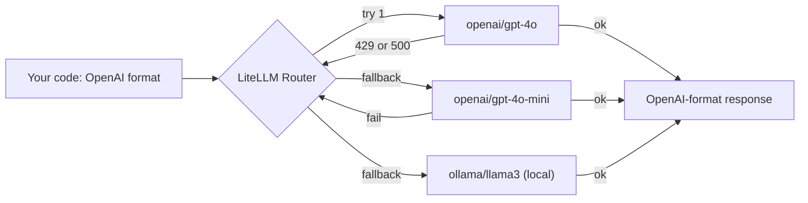

# 04 — LiteLLM: Multi-Provider Router

> Phase 1 · Module 1.2 · Lesson 4 · `[JD VERIFIED — 85%]`

## 🗺️ Stage 0 — Concept Map

You can now call OpenAI (01), Claude (02), and Azure (03) — but each has a *different* SDK, shape, and
error type. **LiteLLM** collapses all of them into **one OpenAI-format interface for 100+ providers**,
plus **fallbacks** and **load-balancing**. It's in ~85% of JDs and is essentially the heart of the
Phase 1 **gateway milestone**. Builds on lessons 01–03 and the resilience ideas from Module 1.1
lesson 03.

## 🔑 New Terms (plain English)

- **LiteLLM** — a library that calls 100+ LLM providers using the **OpenAI format** (`pip install litellm`).
- **Unified interface** — one function (`completion(...)`) for every provider.
- **Model string** — `"provider/model"`, e.g. `"openai/gpt-4o"`, `"anthropic/claude-..."`, `"ollama/gemma3"`.
- **Router** — a LiteLLM object that spreads calls across deployments with **retries, fallbacks, load-balancing**.
- **Fallback** — if provider A fails, automatically try provider B.
- **Proxy / AI Gateway** — LiteLLM run as a standalone server your whole team calls.
- **`acompletion`** — the async version of `completion` (for FastAPI).
- **`completion_cost`** — a LiteLLM helper that computes the $ cost of a response.
- **Routing strategy** — how the Router picks among healthy backends (shuffle / least-busy / latency).
- **Budget** — a spend cap LiteLLM (Proxy) can enforce per key/user/project.

## 🎈 Stage 1 — The Simple Idea (analogy: a universal travel adapter + switchboard)

Every country has a different power socket (each provider's SDK). **LiteLLM is the universal travel
adapter**: you bring one plug (the OpenAI format) and it fits everything. It's also a **switchboard
operator** — if one line is busy or down, it instantly reroutes your call to a backup provider.

**The "Aha!":** write your code **once** in OpenAI format; LiteLLM translates to whatever provider
you name — and can **fail over** to another provider automatically.

**💢 Without LiteLLM (the old/painful way)** — to support several providers you'd write an adapter per
provider and branch on it everywhere:

```python
if provider == "openai":      r = openai_client.chat.completions.create(...)
elif provider == "anthropic": r = anthropic_client.messages.create(...)   # different shape!
elif provider == "azure":     r = azure_client.chat.completions.create(...)
# ...then normalise three different response & error shapes by hand
```

LiteLLM collapses all of that into one call.

### 📊 Diagram — the fallback chain



One call shape in, an OpenAI-format response out — and the Router **fails over** provider→provider so a single outage never takes you down.

## ⚙️ Stage 2 — How It Actually Works

### 4.1 One function, any provider

```python
import os
from litellm import completion

os.environ["OPENAI_API_KEY"] = "..."          # LiteLLM reads each provider's standard env var
os.environ["ANTHROPIC_API_KEY"] = "..."

# Same call shape; only the model STRING changes the provider:
r1 = completion(model="openai/gpt-4o",                    messages=[{"role":"user","content":"Hi!"}])
r2 = completion(model="anthropic/claude-sonnet-4-20250514", messages=[{"role":"user","content":"Hi!"}])
r3 = completion(model="ollama/gemma3",                    messages=[{"role":"user","content":"Hi!"}])

print(r1.choices[0].message.content)   # ALWAYS OpenAI-format response, even for Claude/Ollama
print(r1.usage.total_tokens)           # usage is normalised too
```

LiteLLM hides the per-provider quirks from lesson 02 (Claude's `max_tokens`, `system`, content blocks)
behind the familiar OpenAI shape — including the **response, `usage`, and error types**.

**Native provider SDK vs LiteLLM (pick one):**
- **LiteLLM** (one OpenAI-format call for all)
  - **✅ Use when:** you want portability across providers, automatic failover, or unified cost tracking.
  - **🚫 Avoid when → use the native SDK:** you need a provider-only feature LiteLLM doesn't map (e.g. Claude's extended thinking, the Responses-API state).
  - **⚠️ Gotcha:** not every provider feature maps 1:1 — niche options may be missing or behave differently.
- **Native provider SDK** (lessons 01–03)
  - **✅ Use when:** you're committed to one provider and want its newest/unique features directly.
  - **🚫 Avoid when → use LiteLLM:** you support multiple providers or want failover without per-SDK branching.
  - **⚠️ Gotcha:** you hand-write and maintain a different call shape and error type per provider.

### 4.2 Async + streaming (what you use in FastAPI)

```python
from litellm import acompletion

async def ask(prompt: str) -> str:
    r = await acompletion(model="openai/gpt-4o", messages=[{"role":"user","content":prompt}])
    return r.choices[0].message.content

# streaming (any provider) — same OpenAI delta shape, forward as SSE (1.1 L04):
for chunk in completion(model="anthropic/claude-sonnet-4-20250514",
                        messages=[{"role":"user","content":"Hi"}], stream=True):
    print(chunk.choices[0].delta.content or "", end="")
```

### 4.3 The Router — fallbacks, retries & load-balancing (the resilience win)

```python
from litellm import Router

router = Router(
    model_list=[
        {"model_name": "chat",                                       # a friendly alias your app calls
         "litellm_params": {"model": "azure/my-gpt4o", "api_key": "...", "api_base": "..."}},
        {"model_name": "chat",                                       # same alias, OpenAI backend
         "litellm_params": {"model": "openai/gpt-4o"}},
        {"model_name": "chat",                                       # same alias, Anthropic backend
         "litellm_params": {"model": "anthropic/claude-sonnet-4-20250514"}},
    ],
    fallbacks=[{"chat": ["chat"]}],            # on failure, try the next backend for this alias
    num_retries=2,                              # retry transient errors before failing over
    routing_strategy="least-busy",             # how to pick among healthy backends
)

resp = router.completion(model="chat", messages=[{"role": "user", "content": "Hello!"}])
```

Your app calls one alias, `"chat"`, and the Router **load-balances** (spreads the calls) across
Azure/OpenAI/Anthropic, **retries** transient errors, and **fails over** when a backend is down — the
multi-provider resilience JDs mean, with zero code change at the call site.

### 4.4 Cost tracking & budgets (across providers)

LiteLLM normalises **cost** too — essential when you're spending across several providers:

```python
from litellm import completion, completion_cost

r = completion(model="openai/gpt-4o", messages=[{"role":"user","content":"Hi"}])
print(completion_cost(completion_response=r))   # $ for THIS call (uses live price tables)
```

The **Proxy** (4.5) goes further: per-key/user/project **budgets** that reject calls once a spend cap
is hit — central cost governance for a whole org.

### 4.5 LiteLLM Proxy (AI Gateway) — awareness

LiteLLM can also run as a **standalone server** so your whole org calls *one* endpoint with virtual
keys, spend tracking, and guardrails (automated safety checks):

```powershell
litellm --model gpt-4o            # starts a gateway at http://0.0.0.0:4000
```
```python
import openai                                  # call it with the PLAIN OpenAI client:
client = openai.OpenAI(api_key="anything", base_url="http://0.0.0.0:4000")
client.chat.completions.create(model="gpt-4o", messages=[{"role":"user","content":"Hi"}])
```

That proxy **is** essentially the Phase 1 milestone (a streaming, multi-provider gateway) — you'll
build a focused version yourself to understand the pieces.

**Python SDK vs Proxy server (pick one):**
- **LiteLLM Python SDK** (`import litellm` in your app)
  - **✅ Use when:** routing/failover lives *inside* one app or service.
  - **🚫 Avoid when → use the Proxy:** many apps/teams need one shared entry point and central control.
  - **⚠️ Gotcha:** each app configures its own model list — there's no org-wide view of spend.
- **LiteLLM Proxy (AI Gateway)** (standalone server)
  - **✅ Use when:** a whole org should call one endpoint with virtual keys, central budgets, and guardrails.
  - **🚫 Avoid when → use the SDK:** a single app — running a separate server is extra ops work.
  - **⚠️ Gotcha:** it's another service to deploy, secure, and keep available.

> 🔬 **Under the hood:** LiteLLM maps the `provider/model` string to a **provider adapter** that
> translates your OpenAI-format call into that provider's native API, then normalises the reply (and
> errors) **back** to the OpenAI shape. The `Router` keeps health/load state per backend and picks one
> each call; on failure it transparently re-issues the request to the next backend in the fallback list.

## 🚀 Stage 3 — In Practice / Why It Matters

LiteLLM is how real teams **avoid vendor lock-in** (being stuck with one provider), get **automatic
failover**, and centralise **cost tracking** across providers. "Provider-agnostic," "fallback," and "LLM gateway" in a JD usually mean
exactly this. You'll lean on it for the gateway milestone.

## ⚖️ Variations & When to Use

| Decision | Options | Use which |
| --- | --- | --- |
| **SDK vs Proxy** | LiteLLM Python SDK vs Proxy server | **SDK** to embed routing in your app · **Proxy** for an org-wide gateway (virtual keys, central spend/budgets) |
| **Native SDK vs LiteLLM** | provider SDK vs LiteLLM | **native** when you need a provider-only feature (e.g. Claude thinking) · **LiteLLM** for portability + failover |
| **Routing strategy** | simple-shuffle vs least-busy vs latency-based | **least-busy/latency** under load · shuffle for basics |
| **Fallbacks** | per-alias vs cross-provider chain | a **cross-provider chain** (Azure→OpenAI→Anthropic) for real resilience |

## 🐛 Common Errors & Fixes

| What you see | Cause | Fix |
| --- | --- | --- |
| `BadRequestError: LLM Provider NOT provided` | Missing `provider/` prefix | Use `"openai/gpt-4o"`, not `"gpt-4o"` |
| `AuthenticationError` | Provider's env key not set | Set that provider's standard env var |
| Fallback never triggers | No `fallbacks=` configured | Add `fallbacks=[...]` to the `Router` |
| A provider-only feature missing | Not all features map 1:1 | Check LiteLLM's provider docs; degrade gracefully |
| Different response shape than expected | Read it as non-OpenAI | It's always OpenAI format: `.choices[0].message.content` |

## 📌 Quick Reference

```python
from litellm import completion, acompletion, Router, completion_cost
completion(model="openai/gpt-4o", messages=[...])        # provider/model string
await acompletion(model="anthropic/claude-...", messages=[...])   # async (FastAPI)
# streaming: completion(..., stream=True)  ·  cost: completion_cost(completion_response=r)

Router(model_list=[...], fallbacks=[{"chat": ["chat"]}], num_retries=2, routing_strategy="least-busy")
# proxy:  litellm --model gpt-4o   ->   OpenAI client with base_url="http://0.0.0.0:4000"
```
- **One OpenAI-format call for 100+ providers** · `provider/model` strings · **Router = retries + failover + load-balance** · **cost/budgets** · proxy = org gateway.

> 🎯 **Interview angle:** "How do you avoid vendor lock-in / add LLM failover?" → LiteLLM: one
> OpenAI-format interface across providers, and a `Router` with `fallbacks` so a failed provider
> automatically rolls over to another — optionally run as a proxy gateway for the whole org.

## 🛑 STOP — Self-Check

You call `completion(model="claude-sonnet-4-20250514", messages=[...])` and get
`LLM Provider NOT provided`. What's missing — and after you fix it, what shape is the response in,
even though Claude natively returns content blocks?

<details><summary>Answer</summary>

The **provider prefix** is missing: LiteLLM needs `"anthropic/claude-sonnet-4-20250514"` (the
`provider/model` format) so it knows which backend to route to. Once fixed, the response comes back in
**OpenAI format** — you read `response.choices[0].message.content` — because LiteLLM normalises every
provider (including Claude's content-block shape) into the OpenAI structure for you.
</details>
