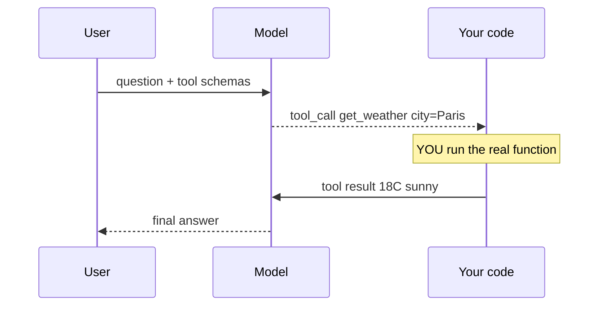

# 06 — Tool / Function Calling

> Phase 1 · Module 1.2 · Lesson 6 · `[MUST — gap-add; the agent foundation]`

## 🗺️ Stage 0 — Concept Map

So far the model can only **talk**. **Tool calling** (a.k.a. function calling) lets it **act** — ask
*your* code to look something up, do a calculation, or hit an API, then use the result to answer. It's
the single most important modern LLM-API capability and appears in the large majority of LLM JDs. It's
also the **foundation of agents (Phase 3)** and **ReAct (Module 1.3)**. Builds on lessons 01–04 and
Pydantic/JSON from Phase 0.

## 🔑 New Terms (plain English)

- **Tool / function calling** — giving the model a list of functions it's *allowed to request*.
- **Tool schema** — a JSON description of a function: its name, what it does, and its parameters.
- **Tool call** — the model's structured request: *"call `get_weather` with `{city: 'Paris'}`"*.
- **The tool-calling loop** — model asks → **your code runs the function** → you send the result back
  → model writes the final answer.
- **Parallel tool calls** — the model requesting several tools at once.
- **`tool_choice`** — control whether/which tool the model must use (`auto`/`required`/`none`/specific).
- **Pydantic-generated schema** — produce the tool's JSON schema from a Pydantic model (`model_json_schema()`).

## 🎈 Stage 1 — The Simple Idea (analogy: an assistant who can't reach the filing cabinet)

Imagine a brilliant assistant locked in a room. Ask *"what's the weather in Paris?"* and instead of
**guessing**, they hand you a sticky note: **"look up get_weather(Paris)."** You walk to the cabinet
(run the real function), bring back the answer, and *then* they write the polished reply.

**The "Aha!":** the model **never runs your code** — it only *requests* a call and reads the result
**you** give it. You stay in control of what actually executes.

**💢 The old/painful way** — before tool calling, to let a model "use" a function you'd ask it in prose
("reply with the function to call"), then **parse free text** and hope it picked a real function with
valid arguments. Tool calling makes that request **structured and reliable**.

### 📊 Diagram — the tool-calling loop



The model only **requests** a call — **your code** runs it and returns the result. The model never executes your code.

## ⚙️ Stage 2 — How It Actually Works

### 6.1 Describe the tool (a JSON schema)

```python
tools = [{
    "type": "function",
    "function": {
        "name": "get_weather",
        "description": "Get the current weather for a city.",
        "parameters": {                      # JSON Schema for the arguments
            "type": "object",
            "properties": {"city": {"type": "string", "description": "City name"}},
            "required": ["city"],
        },
    },
}]
```

**Cleaner variation — generate the schema from Pydantic** (don't hand-write JSON for complex args):

```python
from pydantic import BaseModel

class WeatherArgs(BaseModel):
    city: str

schema = WeatherArgs.model_json_schema()        # -> the JSON Schema for "parameters"
tools = [{"type": "function", "function": {"name": "get_weather",
          "description": "Get the current weather for a city.", "parameters": schema}}]
```

### 6.2 The tool-calling loop (OpenAI Chat Completions)

```python
from openai import OpenAI
client = OpenAI()

def get_weather(city: str) -> str:           # YOUR real function
    return f"18°C and sunny in {city}"

messages = [{"role": "user", "content": "What's the weather in Paris?"}]

# 1) Ask the model, offering the tool
first = client.chat.completions.create(model="gpt-5.5", messages=messages, tools=tools)
msg = first.choices[0].message

# 2) Did it request a tool?
if msg.tool_calls:
    messages.append(msg)                     # keep the model's tool request in the history
    for call in msg.tool_calls:
        import json
        args = json.loads(call.function.arguments)     # e.g. {"city": "Paris"}
        result = get_weather(**args)                   # 3) YOU run the function
        messages.append({                              # 4) feed the result back
            "role": "tool",
            "tool_call_id": call.id,
            "content": result,
        })
    # 5) Ask again — now the model has the data and writes the final answer
    final = client.chat.completions.create(model="gpt-5.5", messages=messages, tools=tools)
    print(final.choices[0].message.content)            # "It's 18°C and sunny in Paris."
```

The five steps — **offer → model requests → you execute → return result → model answers** — are the
whole pattern. Everything about agents is this loop, repeated.

### 6.3 The agent loop — keep going until done

One round handles one tool. Real tasks need **several** (look up the city, then its weather). Wrap the
call in a **`while`/`for` loop** that runs tools until the model stops requesting them — with a **cap**:

```python
messages = [{"role": "user", "content": "Weather in the capital of France?"}]
for _ in range(5):                                  # CAP the rounds (never loop forever)
    r = client.chat.completions.create(model="gpt-5.5", messages=messages, tools=tools)
    msg = r.choices[0].message
    if not msg.tool_calls:                          # no tool requested -> it's the final answer
        print(msg.content); break
    messages.append(msg)
    for call in msg.tool_calls:                     # may be SEVERAL (parallel) — run them all
        result = run_tool(call.function.name, json.loads(call.function.arguments))
        messages.append({"role": "tool", "tool_call_id": call.id, "content": result})
```

**This capped loop *is* a minimal agent** (Phase 3) — reason, act, observe, repeat until done.

### 6.4 Controlling tool use: `tool_choice` & parallel calls

```python
client.chat.completions.create(model="gpt-5.5", messages=msgs, tools=tools,
    tool_choice="auto",          # default: model decides whether to call a tool
    #          "required"  -> MUST call some tool   .   "none" -> never (text only)
    #          {"type":"function","function":{"name":"get_weather"}}  -> force THIS tool
    parallel_tool_calls=True,    # default: model may request several tools at once
)
```

**`tool_choice` — which mode (pick one):**
- **`auto`** (default) — the model decides whether to call a tool.
  - **✅ Use when:** normal use — the model may or may not need a tool.
  - **🚫 Avoid when → use `required`:** you *know* a tool must run (e.g. every request needs a lookup).
  - **⚠️ Gotcha:** the model sometimes answers from memory instead of calling the tool you expected.
- **`required`** — the model **must** call some tool.
  - **✅ Use when:** the answer must come from a tool — forced extraction, "always search first."
  - **🚫 Avoid when → use `auto`:** a plain conversational reply is a valid answer.
  - **⚠️ Gotcha:** it forces *a* tool, not a *specific* one — name a tool to force exactly that.
- **`none`** — the model may **not** call tools (text only this turn).
  - **✅ Use when:** you want a plain text answer even though tools are defined.
  - **🚫 Avoid when → use `auto`:** the task might genuinely need a tool.
  - **⚠️ Gotcha:** the tools are still sent (and billed in the prompt) — `none` only blocks *calling* them.
- **A specific tool** (`{"type":"function","function":{"name":"get_weather"}}`) — force exactly one.
  - **✅ Use when:** you must run one known function (a single-purpose endpoint, structured extraction).
  - **🚫 Avoid when → use `auto`/`required`:** the model should choose among several tools.
  - **⚠️ Gotcha:** the model can't pick a *different* tool even when one would fit better.

Turn **`parallel_tool_calls` off** when calls must run in a strict order (one depends on another's result).

### 6.5 Other providers (same idea, different shape)

- **Anthropic:** pass `tools=[...]`; the reply has `stop_reason="tool_use"` and a `tool_use` content
  block; you reply with a `tool_result` block. Same loop.
- **LiteLLM (lesson 04):** uses the **OpenAI** `tools` format above across providers — so you write the
  loop **once** and it works for many models.

### 6.6 Guardrails

- **Cap the loop** (e.g. max 5 rounds) so a model can't call tools forever.
- **Validate arguments** (the model can hallucinate — invent — bad args) — Pydantic-check before executing.
- **Treat tool inputs as untrusted** — never `eval()` them; guard side-effects — actions that change real state (an OWASP concern).

> 🔬 **Under the hood:** your tool **schemas are injected into the prompt**, and the model is *trained*
> to emit a structured `tool_calls` JSON (not prose) when it decides to call one — the provider signals
> this with `finish_reason="tool_calls"` (OpenAI) / `stop_reason="tool_use"` (Claude). The model **never
> executes anything**; your loop runs the function and feeds the result back as a new message, and the
> model conditions its final answer on that.

## 🚀 Stage 3 — In Practice / Why It Matters

Tool calling turns an LLM from a chatbot into something that can **query your database, call your
APIs, search, and compute**. It's the mechanism behind **agents**, **MCP**, and **ReAct** (Phase 3 /
Module 1.3). Nearly every "build with LLMs" JD expects you to know this loop — and to know that **your
code**, not the model, executes the tools.

## ⚖️ Variations & When to Use

| Decision | Options | Use which |
| --- | --- | --- |
| **Schema source** | hand-written JSON vs **Pydantic** `model_json_schema()` | Pydantic for non-trivial args (no repetition + validated) · hand-written for a one-field tool |
| **`tool_choice`** | `auto` / `required` / `none` / specific | **auto** normally . **required** to force a call . **none** for text-only . **specific** to force one tool |
| **Parallel calls** | on (default) vs off | **on** for independent lookups . **off** when calls must run in a strict order |
| **Rounds** | single round vs multi-round (capped) loop | **multi-round** for real agents that chain tools (always cap the count) |

## 🐛 Common Errors & Fixes

| What you see | Cause | Fix |
| --- | --- | --- |
| Nothing happens / no function runs | Expected the model to execute it | **You** run the function; the model only *requests* it |
| Model loops asking for the tool again | Didn't send the result back | Append a `role:"tool"` message with the `tool_call_id` |
| `JSONDecodeError` on arguments | Args are a JSON **string** | `json.loads(call.function.arguments)` |
| Crash on bad arguments | Model hallucinated args | Validate with Pydantic before executing |
| Infinite tool loop | No stop condition | Cap the number of rounds |

## 📌 Quick Reference

```python
tools = [{"type":"function","function":{"name":...,"description":...,"parameters":{...JSON schema...}}}]
r = client.chat.completions.create(model=..., messages=msgs, tools=tools)
if r.choices[0].message.tool_calls:           # model requested a tool
    args = json.loads(call.function.arguments)
    result = my_func(**args)                   # YOU execute it
    msgs += [r.choices[0].message, {"role":"tool","tool_call_id":call.id,"content":result}]
    final = client.chat.completions.create(model=..., messages=msgs, tools=tools)  # model answers
```
- Loop: **offer → request → you execute → return result → answer.** Model never runs your code.
- Validate args, cap rounds, treat inputs as untrusted. LiteLLM uses this same OpenAI format everywhere.

> 🎯 **Interview angle:** "How does function/tool calling work?" → you give the model JSON tool
> schemas; it returns a structured *request* to call one; **your** code executes it and feeds the
> result back; the model then produces the final answer. It's the foundation of agents — and the model
> never executes anything itself.

## 🛑 STOP — Self-Check

A teammate says "tool calling lets the LLM run our `get_weather` function by itself." Correct the
misconception, and name the step people most often forget that leaves the model stuck repeating the
request.

<details><summary>Answer</summary>

The LLM **does not run your function** — it only returns a **structured request** ("call `get_weather`
with these arguments"). **Your code** executes the function; the model just reads the result you give
back. The commonly forgotten step is **sending the result back** to the model (appending a
`role:"tool"` / `tool_result` message with the matching `tool_call_id`). Without it, the model never
gets the data and keeps asking for the tool.
</details>
