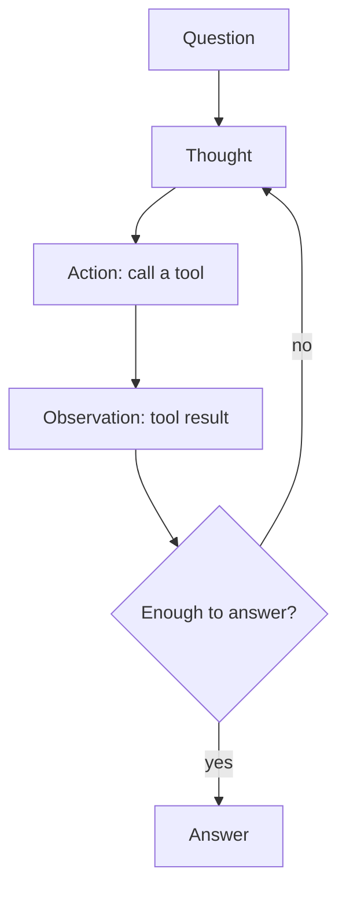

# 03 — Reasoning Patterns: Few-shot, Chain-of-Thought & ReAct

> Phase 1 · Module 1.3 · Lesson 3 · `[JD VERIFIED — 75%]`

## 🗺️ Stage 0 — Concept Map

*How* you ask changes *how well* the model answers — often more than which model you pick. This lesson
climbs the ladder of prompting techniques: **zero-shot → few-shot → Chain-of-Thought → ReAct**. The
top rung, **ReAct**, combines reasoning with the **tool calling** from Module 1.2 lesson 06 and is the
direct **foundation of agents (Phase 3)**. In ~75% of JDs. Uses the templates from lesson 02.

## 🔑 New Terms (plain English)

- **Zero-shot** — just ask, no examples.
- **Few-shot** — include a few worked **examples** in the prompt so the model copies the pattern.
- **In-context learning** — the model "learning" the task purely from those in-prompt examples (no training).
- **Chain-of-Thought (CoT)** — asking the model to **show its step-by-step reasoning** before answering.
- **ReAct (Reason + Act)** — a loop of **Thought → Action (tool call) → Observation → … → Answer**.

## 🎈 Stage 1 — The Simple Idea (analogy: briefing a colleague)

Four ways to ask a colleague to do a task:
- **Zero-shot:** "Categorise this ticket." (they guess your format)
- **Few-shot:** "Here are 3 examples of how we categorise — now do this one." (they copy the pattern)
- **Chain-of-Thought:** "Show your working." (fewer silly mistakes on multi-step problems)
- **ReAct:** "Think, look up what you need, then answer." (they reason *and* use tools)

**The "Aha!":** giving examples and asking for reasoning costs only a few extra tokens but sharply
improves reliability — and ReAct is just CoT that's allowed to **use tools** between thoughts.

**💢 The old/painful way (zero-shot on a hard problem)** — ask a multi-step question and the model
**blurts the first guess** in one leap, often wrong. The techniques below — examples, visible
reasoning, and tool use — systematically fix that.

## ⚙️ Stage 2 — How It Actually Works

### 3.1 Zero-shot → Few-shot (in-context learning)

```python
# Zero-shot:
messages = [{"role": "user", "content": "Sentiment of: 'I love this!'"}]

# Few-shot: show the pattern (use a Jinja2 template from lesson 02 to build this cleanly)
messages = [{"role": "user", "content": """Classify sentiment as positive/negative.
Text: "Best purchase ever" -> positive
Text: "Total waste of money" -> negative
Text: "I love this!" ->"""}]
```

Few-shot makes the **output format** and **edge-case handling** far more consistent — the model
mimics your examples. **How many?** ~**3–5 examples** is usually the sweet spot — enough to show the
pattern, not so many you burn tokens. (Keep them representative; bad examples teach bad habits.)

### 3.2 Chain-of-Thought (CoT)

```python
# Adding one phrase often fixes multi-step reasoning:
prompt = "If a shirt costs $20 after a 20% discount, what was the original price? " \
         "Let's think step by step."     # <- the classic CoT trigger
```

Asking for steps lets the model **work through** the problem instead of blurting the first guess —
a big accuracy win on maths, logic, and multi-hop (several-linked-steps) questions.

> 🔎 **Currency note:** modern **"reasoning models"** do this internally and may not need an explicit
> "think step by step." CoT still helps on standard models and for making reasoning *visible*.

### 3.3 ReAct — reason *and* act (the agent foundation)

ReAct interleaves (alternates) **thinking** with **tool calls** (Module 1.2 lesson 06). The model
produces a **Thought**, takes an **Action** (call a tool), reads the **Observation** (the result), and
repeats until it can **answer**:

```text
Question: What's the weather in the capital of France?
Thought:  I need the capital of France, then its weather.
Action:   get_capital("France")
Observation: Paris
Thought:  Now I need Paris's weather.
Action:   get_weather("Paris")
Observation: 18°C, sunny
Thought:  I can answer now.
Answer:   It's 18°C and sunny in Paris.
```

In code this is the **tool-calling loop** from lesson 06, run repeatedly until the model stops
requesting tools. **That loop, automated and generalised, *is* an agent (Phase 3).** RAG (Phase 2)
is a simple one-step version: retrieve (act) → answer (reason).

### 📊 Diagram — the ReAct loop



The loop repeats **Thought → Action → Observation** until the model has enough to answer — cap the iterations so it can't spin forever.

### 3.4 Picking a technique (the escalation ladder)

Climb only as high as the task needs — each rung costs more tokens and latency:

- **Zero-shot** — just ask, no examples.
  - **✅ Use when:** the task is simple and the format is obvious.
  - **🚫 Avoid when → use few-shot:** the output format or edge-cases come back inconsistent.
  - **⚠️ Gotcha:** on anything format-sensitive or multi-step, it quietly guesses.
- **Few-shot** — add a few worked examples.
  - **✅ Use when:** you need a **specific output format** or consistent edge-case handling.
  - **🚫 Avoid when → use CoT:** the problem needs *reasoning*, not just copying a pattern.
  - **⚠️ Gotcha:** bad or contradictory examples teach bad habits — keep ~3–5 clean, representative ones.
- **Chain-of-Thought (CoT)** — ask for step-by-step reasoning.
  - **✅ Use when:** the task needs **multi-step reasoning** (maths, logic, planning).
  - **🚫 Avoid when → use ReAct:** the model needs *external data or actions* it can't reason its way to.
  - **⚠️ Gotcha:** skip the explicit "think step by step" on reasoning models (o-series) — they already do it.
- **ReAct** — reason, call a tool, observe, repeat.
  - **✅ Use when:** the model needs **external information or actions** (tools, search, DB) to answer.
  - **🚫 Avoid when → use CoT/few-shot:** everything needed is already in the prompt — tools just add cost and loops.
  - **⚠️ Gotcha:** always **cap the iterations** (lesson 06), or it can loop forever.

### 3.5 Awareness: Tree-of-Thought & reasoning models `[awareness]`

- **Tree-of-Thought (ToT)** — instead of one reasoning chain, the model explores **several branches**
  and keeps the best. More accurate on hard puzzles, but several times the cost — **reach for it
rarely**, for genuinely complex decomposition (breaking a problem into parts).
- **Reasoning models (OpenAI o-series, DeepSeek-R1)** do CoT-style thinking **internally**, trading
  **higher latency and cost** for stronger reasoning. Use them for hard problems and a normal model
  for simple/fast ones — and **don't** add "think step by step" (they already do).
- **Self-consistency** — run CoT **several times** (higher temperature) and take the **majority
  answer**. More reliable on tricky problems, but N× the cost — reserve for high-stakes questions.

> 🔬 **Under the hood:** these aren't model settings — they're just **what you put in the prompt**.
> Few-shot works via *in-context learning* (the model bases its answer on your in-prompt examples). CoT
> works because generating intermediate tokens lets each step **build on the reasoning so far** (more
> compute spent per answer). ReAct's loop is literally the **tool-calling loop** from Module 1.2 lesson
> 06, repeated.

## 🚀 Stage 3 — In Practice / Why It Matters

These patterns are your highest-leverage, lowest-cost quality levers. Few-shot stabilises outputs,
CoT boosts reasoning, and **ReAct is the blueprint for every agent and tool-using RAG system** you'll
build in Phases 2–3. "Prompt engineering," "CoT," and "ReAct/agentic" in JDs point straight here.

## ⚖️ Variations & When to Use

| Technique | Cost | Use when |
| --- | --- | --- |
| **Zero-shot** | cheapest | the task is simple/obvious |
| **Few-shot** | + example tokens | you need a **specific format** or consistent edge-case handling |
| **Chain-of-Thought** | + reasoning tokens | **multi-step reasoning** (math, logic, planning) — skip on reasoning models (built-in) |
| **ReAct** | + tool round-trips | the model needs **external info/actions** (tools, search, DB) to answer |
| **Self-consistency / ToT** | N× cost | high-stakes, genuinely hard problems only |

Ladder of escalation: **zero-shot → few-shot → CoT → ReAct**; reach for self-consistency/ToT only when
accuracy matters more than cost.

## 🐛 Common Errors & Fixes

| What you see | Cause | Fix |
| --- | --- | --- |
| Inconsistent output format | Zero-shot on a format-sensitive task | Add 2–3 **few-shot** examples of the exact format |
| Wrong answers on multi-step problems | Model guessing in one leap | Add **Chain-of-Thought** ("think step by step") |
| ReAct "loops forever" | No stop condition | Cap iterations (Module 1.2 lesson 06) |
| ReAct can't act | No tools wired up | Provide tools; ReAct needs **tool calling** |
| Few-shot makes it worse | Bad/contradictory examples | Use clean, representative examples |

## 📌 Quick Reference

- **Zero-shot** → just ask. **Few-shot** → add worked examples (in-context learning).
- **CoT** → "let's think step by step" for multi-step reasoning (reasoning models do it internally).
- **ReAct** → Thought → Action (tool) → Observation → … → Answer = the **agent loop** (Phase 3), built on tool calling (1.2 L06).

> 🎯 **Interview angle:** "What is ReAct?" → a prompting pattern that interleaves **reasoning**
> (Thought) with **acting** (tool calls) and **observing** results, looping until it can answer. It's
> Chain-of-Thought plus tool use, and it's the foundation of agentic systems.

## 🛑 STOP — Self-Check

You need the model to answer *"How many days until my next invoice?"*, which requires looking up the
invoice date in your database. Which pattern fits — few-shot, CoT, or ReAct — and why?

<details><summary>Answer</summary>

**ReAct.** The question can't be answered from the model's knowledge alone — it needs **external
data** (the invoice date from your DB). ReAct lets the model **reason** ("I need the invoice date"),
**act** (call a `get_invoice_date` tool — Module 1.2 lesson 06), read the **observation** (the date),
then compute and **answer**. Few-shot only fixes format, and CoT only helps it reason over information
it *already* has — neither can fetch the date. (This act→observe→answer loop is exactly what an agent
does.)
</details>
