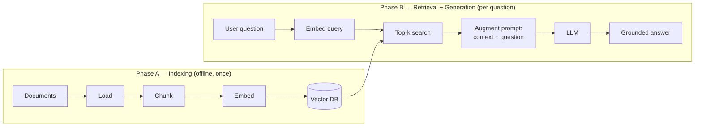

# 01 — RAG Pipeline Architecture

> Phase 2 · Module 2.1 · Lesson 1 · `[MUST KNOW — appears in ~90% of AI-engineer JDs]`

## 🗺️ Stage 0 — Concept Map

**The problem first.** An LLM only knows what was in its training data, frozen at a **cutoff date**.
Ask it about *your* company's contracts, yesterday's support tickets, or a 500-page PDF it never saw,
and it will either admit "I don't know" or — far worse — answer confidently with something invented
(a **hallucination**). And you can't re-train a giant model every time a document changes: it's slow,
expensive, and you'd need to do it constantly.

**RAG (Retrieval-Augmented Generation)** solves this *without touching the model's weights*. When a
question arrives, you **retrieve** the most relevant snippets from your own documents and **paste them
into the prompt**, so the model answers from real, current, private text that is sitting right in
front of it — instead of from hazy memory.

**Where this sits.** This is the **foundation lesson of Phase 2**. Everything that follows is one
stage of the pipeline you meet here: ingestion (02), chunking (03), embeddings (04), vector databases
(Module 2.2), hybrid search + reranking (Module 2.3), and vision RAG (Module 2.4).

**Why you should care.** "Build a RAG system over our documents" is the single most common first task
for an AI engineer in 2026, and RAG is the most-requested skill on the role's job descriptions
(~85–90%). Get this mental model right and the rest of the phase is just filling in each box.

## 🔑 New Terms (plain English)

- **RAG (Retrieval-Augmented Generation)** — retrieve relevant text first, then let the LLM generate
  an answer *using* that text.
- **Corpus / knowledge base** — the collection of documents you want the model to answer from.
- **Chunk** — a small piece of a document (a few sentences/paragraphs) — the unit you store and
  retrieve. (Lesson 03.)
- **Embedding** — a list of numbers (a **vector**) that captures the *meaning* of a chunk, so similar
  meanings sit close together in number-space. (Lesson 04.)
- **Vector** — an ordered list of numbers, e.g. `[0.01, -0.23, …]` (length 1536 for a common model).
- **Vector database** — a store built to find the vectors *nearest* to a query vector, fast.
  (Module 2.2.)
- **Semantic search** — search by *meaning* (via embeddings), not exact keywords — "car" matches
  "automobile".
- **Top-k retrieval** — fetch the `k` most-relevant chunks (e.g. top-4).
- **Grounding** — making the model answer *from supplied text* rather than its own memory.
- **Index time vs query time** — work done **once, offline** to prepare documents (index) vs work done
  **per question, online** (query).
- **Hallucination** — a fluent but false answer the model made up. (See the
  [AI Terms — Plain-English Glossary](../../AI%20Terms%20-%20Plain%20English%20Glossary.md).)

## 🎈 Stage 1 — The Simple Idea (analogy: an open-book exam)

Picture two students sitting the same exam.

- A **plain LLM** is a student taking a **closed-book** exam: they answer purely from memory. Fast and
  often impressive — but on any topic they didn't revise, they *guess*, sometimes very convincingly.
- **RAG** turns it into an **open-book** exam with a **librarian**. The moment a question is read, the
  librarian sprints to the shelves, grabs the three or four most relevant pages, and lays them on the
  desk. The student then answers **from those pages**.

**The "Aha!":** RAG doesn't make the model *know* more. It makes the *right text present* at the moment
of answering. The model's job changes from "remember the whole library" to "read these few pages and
summarise them accurately."

## ⚙️ Stage 2 — How It Actually Works

**💢 The old/painful way** — before RAG, you had three bad options for "make the model answer from our
docs": (1) **fine-tune** the model on the documents — costly, slow, and out of date the moment a file
changes; (2) **paste the entire corpus** into every prompt — impossible past a few documents (it
overflows the context window and costs a fortune); or (3) just **let it guess** and hope it doesn't
hallucinate. RAG replaces all three: retrieve only the few relevant snippets, per question.

A RAG system has **two phases**. The first is done **offline, once** (and repeated only when documents
change). The second runs **online, on every question**.

### 2.1 Phase A — Indexing (offline: prepare the knowledge base)

Four steps turn raw documents into a searchable index:

1. **Load** — read the raw files (PDF, HTML, DOCX…) into plain text. (Lesson 02.)
2. **Chunk** — split each document into small pieces, because you want to retrieve a *paragraph*, not
   a whole 50-page report. (Lesson 03.)
3. **Embed** — run each chunk through an **embedding model** to get its meaning-vector. (Lesson 04.)
4. **Store** — save each `(vector, chunk text, metadata)` row in a **vector database**. (Module 2.2.)

```python
# pip install openai langchain-text-splitters
# --- Phase A: build the index (run once, offline) ---
from openai import OpenAI
from langchain_text_splitters import RecursiveCharacterTextSplitter

client = OpenAI()                                    # uses OPENAI_API_KEY
raw_text = open("handbook.txt", encoding="utf-8").read()

# 1+2) split into ~500-token chunks with a little overlap so ideas aren't cut in half
splitter = RecursiveCharacterTextSplitter(chunk_size=500, chunk_overlap=50)
chunks = splitter.split_text(raw_text)               # -> list[str]

# 3) embed every chunk (one number-vector per chunk)
resp = client.embeddings.create(
    model="text-embedding-3-small",                  # 1536-dim vectors
    input=chunks,                                    # batch all chunks in one call
)
vectors = [d.embedding for d in resp.data]           # list[list[float]]

# 4) store (vector, text) together — here a plain list stands in for a vector DB
index = list(zip(vectors, chunks))                   # Module 2.2 replaces this with pgvector/etc.
```

### 2.2 Phase B — Retrieval + Generation (online: answer a question)

Per question, four steps:

1. **Embed the query** with the *same* embedding model.
2. **Search** the vector DB for the **top-k** nearest chunks (semantic search).
3. **Augment** — build a prompt that contains the retrieved chunks *plus* the question.
4. **Generate** — the LLM writes a grounded answer from those chunks.

```python
# --- Phase B: answer a question (runs per request) ---
import numpy as np

def cosine(a, b):                                    # similarity = how aligned two vectors are
    a, b = np.array(a), np.array(b)
    return a @ b / (np.linalg.norm(a) * np.linalg.norm(b))

question = "How many vacation days do new employees get?"

# 1) embed the question with the SAME model used for the chunks
q_vec = client.embeddings.create(
    model="text-embedding-3-small", input=[question]
).data[0].embedding

# 2) top-k: rank stored chunks by similarity to the question, keep the best 4
ranked = sorted(index, key=lambda row: cosine(q_vec, row[0]), reverse=True)
top_chunks = [text for _vec, text in ranked[:4]]

# 3) augment: put the retrieved context AND the question into the prompt
context = "\n\n".join(top_chunks)
prompt = (
    "Answer ONLY from the context below. If the answer isn't there, say you don't know.\n\n"
    f"Context:\n{context}\n\nQuestion: {question}"
)

# 4) generate the grounded answer
answer = client.responses.create(model="gpt-5.5", input=prompt).output_text
print(answer)
```

> 🔬 **Under the hood:** the magic is the **embedding** step. The model maps text to points in a
> high-dimensional space where *distance ≈ difference in meaning*, so the query "vacation days" lands
> near a chunk that says "annual leave" even with **zero shared keywords**. Retrieval is then just
> "find the nearest points," and the LLM never *learned* your docs — they're supplied fresh in the
> prompt each call, which is why updating a document is as simple as re-indexing that one file. The
> instruction "answer only from the context" is what turns recall into **grounding**.

**Inline decision — how many chunks (`k`)?** Use **small k (3–5)** by default: enough context, low cost,
less noise. Raise k only when answers need to combine many sources — but more chunks dilute the signal
and risk *lost-in-the-middle* (Phase 1, Context-Window lesson). More is **not** better.

## 🚀 Stage 3 — In Practice / Why It Matters

RAG is the backbone of nearly every enterprise LLM product shipped today:

- **Document Q&A / "chat with your docs"** — policies, contracts, manuals, research.
- **Customer support** — answer from the current knowledge base, with citations, no retraining.
- **Internal copilots** — engineering wikis, runbooks, onboarding handbooks.
- **Analyst tooling** — "what changed in this 200-page filing?"

In the Road Map this lesson is the spine of Phase 2: **02** makes loading real PDFs work, **03** makes
chunking smart, **04** picks the embedding model, **2.2** swaps the toy list for a real vector DB, and
**2.3** upgrades naive top-k into **hybrid search + reranking** for production-grade precision.

## ⚖️ Variations & When to Use

**The big architecture decision: how do I give a model new knowledge?**

- **RAG** — retrieve relevant text at query time and put it in the prompt.
  - **Key features:** uses live/private data, supports citations, updates instantly (just re-index a file).
  - **✅ Use when:** the knowledge is large, changing, private, or must be cited — most cases.
  - **🚫 Avoid when → use fine-tuning:** you need a new *skill, format, or tone*, not new facts.
  - **⚠️ Gotcha:** retrieval quality caps answer quality — bad chunks in, bad answer out.
- **Fine-tuning** — adjust the model's weights on your data.
  - **Key features:** bakes in a behaviour/style/voice; no retrieval step at run time.
  - **✅ Use when:** you need a consistent **behaviour, format, or tone**, or a narrow domain voice.
  - **🚫 Avoid when → use RAG:** facts change often (you'd retrain endlessly) or you need citations.
  - **⚠️ Gotcha:** slow/expensive to redo, and it can't cite where an answer came from. (Phase 4.)
- **Long-context stuffing** — paste whole documents into a big context window.
  - **Key features:** zero retrieval setup; the model sees everything at once.
  - **✅ Use when:** a **single, small** doc set used wholesale, one-off.
  - **🚫 Avoid when → use RAG:** the corpus is large or queried often — cost and lost-in-the-middle bite.
  - **⚠️ Gotcha:** you pay for every token on every call, and accuracy drops as the context grows.

> Rule of thumb: **RAG for *knowledge*, fine-tuning for *behaviour*.** They also combine — fine-tune
> the style, RAG the facts. (Fine-tuning is a Phase 4 topic; here, default to RAG.)

**Naive RAG vs Advanced RAG (the rest of Phase 2):**

| | Naive RAG (this lesson) | Advanced RAG (Modules 2.2–2.3) |
|---|---|---|
| Retrieval | dense top-k only | **hybrid** (BM25 + dense) + **reranking** |
| Storage | in-memory list | real **vector DB** (pgvector / Pinecone / Qdrant) |
| Quality | fine for a demo | needed for production precision |

Start naive to learn the shape; the upgrades are surgical, one box at a time.

### Beyond naive RAG — the advanced landscape `[awareness map]`

Naive RAG (this lesson) is the foundation. Production systems layer techniques on top — here's the **map**
so you know the whole field exists; each is covered where noted, and you reach for it only when evaluation
(Lesson 05) shows naive RAG falling short:

- **Better retrieval:** hybrid search + RRF (Module 2.3 L02), cross-encoder **reranking** (2.3 L03), and
  **diversity reranking / MMR** *(awareness)* — penalise near-duplicate chunks so the top-k isn't five copies
  of the same fact.
- **Better chunks:** smart chunking strategies + **contextual retrieval** (Module 2.1 L03).
- **Query transformation** *(awareness)* — rewrite/expand the *question* before retrieving:
  - **Query rewriting** — turn a messy user query into a clean, search-friendly one.
  - **Multi-query / sub-query decomposition** — split a complex question into several, retrieve for each, merge.
  - **Step-back prompting** — ask a broader question first to pull in background context.
  - **HyDE (Hypothetical Document Embeddings)** — have the LLM draft a *fake ideal answer*, embed **that**, and
    retrieve with it (a hypothetical answer often sits closer to the real passages than the bare question does).
- **Smarter indexing** *(awareness)* — **hierarchical indices** (search summaries first, then drill into
  details) and **RAPTOR** (recursively summarise clusters of chunks into a tree) for large corpora.
- **Agentic / self-correcting RAG** *(awareness; built deep in Phase 3)* — **Self-RAG** (the model decides
  *whether* to retrieve and critiques its own answer) and **Corrective RAG (CRAG)** (grade the retrieved
  context; if it's weak, fall back to web search).

> You don't need any of these to ship a first RAG — but knowing the landscape is what separates "I built a
> RAG demo" from "I can architect one." Add each only when a measured weakness justifies it.

## 🧠 Common Misconceptions

| Misconception | Why it's wrong | The right view |
|---|---|---|
| "RAG **trains** the model on my docs." | The weights never change; chunks are supplied in the prompt. | RAG is *retrieval + prompting*, not training. |
| "Just send the **whole document** every time." | Overflows context and costs scale with tokens. | Retrieve only the few relevant chunks. |
| "Embeddings are **keyword search**." | Embeddings match *meaning* — "car" ≈ "automobile" with no shared words. | It's semantic similarity in vector space. |
| "**More chunks** = better answers." | Extra chunks add noise and trigger lost-in-the-middle. | Small, precise top-k beats a big dump. |
| "RAG **eliminates** hallucinations." | The model can still misread context. | It *reduces* them and enables **citations** to verify. |

## 📌 Quick Reference (cheat-sheet)

```text
INDEX (offline, once):   load → chunk → embed → store in vector DB
QUERY (online, per Q):   embed query → top-k search → augment prompt → generate

Golden prompt:  "Answer ONLY from the context below; if absent, say you don't know."
Default k:      3–5 chunks. chunk_size ~300–800 tokens, overlap ~10–15%.
Same model:     embed chunks AND queries with the SAME embedding model.
```

- **Decision rule:** new *facts* → **RAG**; new *behaviour* → fine-tune; tiny one-off corpus → long-context.
- **Gotchas:** mismatched embedding models (chunks vs query) silently wreck retrieval; no "answer only
  from context" instruction → the model drifts back to memory; chunks too big → fewer, fuzzier matches.

## 🛑 STOP — Self-Check

**Question:** A teammate says, *"Let's skip chunking and embedding — just send all 500 pages to the LLM
with the question each time. Same result, less code."* Give the two main reasons that fails, and what
RAG does instead.

<details>
<summary>Answer</summary>

1. **It doesn't fit / doesn't scale.** 500 pages is far more than the context window for most models,
   and even where it fits, you pay for *every* token on *every* question — cost and latency explode.
2. **Quality drops** — burying the answer in 500 pages of mostly-irrelevant text triggers
   **lost-in-the-middle**: the model attends worst to the middle and gives vaguer answers.

**What RAG does instead:** index once (chunk → embed → store), then per question retrieve only the
**top-k most relevant chunks** and put *those* in the prompt — cheaper, faster, and more accurate,
with the bonus that you can **cite** which chunks the answer came from.
</details>

## 📊 Diagram — the two-phase pipeline



## 🎯 Interview angle

Expect *"Walk me through a RAG pipeline end to end"* and *"RAG vs fine-tuning — when would you pick
each?"* Nail both by naming the **two phases** (index offline / retrieve-generate online) and the
rule **"RAG for knowledge, fine-tuning for behaviour."** Bonus signal: mention that production RAG
adds **hybrid search + reranking** (Module 2.3) and **evaluation with Recall@K** (Lesson 05) — it
shows you know naive RAG isn't enough.
