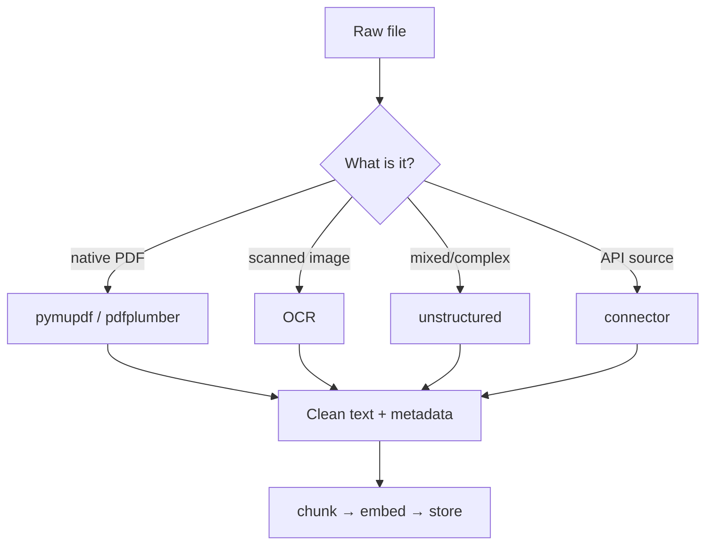

# 02 — Document Ingestion Pipeline

> Phase 2 · Module 2.1 · Lesson 2 · `[MUST KNOW — JD VERIFIED]`

## 🗺️ Stage 0 — Concept Map

**The problem first.** Lesson 01 quietly cheated: it did `open("handbook.txt").read()`. Real enterprise
knowledge is *never* clean `.txt`. It's PDFs with two columns, headers and footers, **scanned**
contracts that are really just images, financial tables, PowerPoints, and wikis behind an API. Feed
that raw mess into chunking and you get garbled half-sentences, tables smashed into word-soup, and —
for scans — *empty strings*. **Garbage in → garbage out:** no embedding model or reranker can save a
RAG system that ingested broken text.

**Document ingestion** is the pipeline stage that turns messy real-world files into **clean, ordered
plain text** (with useful metadata) — ready to chunk and embed. It is unglamorous and it is *roughly
half the work* of a real RAG project.

**Where it sits.** This is step 1 of Phase A (indexing) from Lesson 01: **Load** → chunk → embed →
store. Get it wrong and everything downstream inherits the damage.

**Why care.** Ingestion robustness is what separates a demo (one tidy PDF) from production (10,000
mixed files). JDs list `pypdf`/`pymupdf`/`unstructured`/OCR explicitly.

## 🔑 New Terms (plain English)

- **Ingestion** — loading raw files and extracting clean text + metadata.
- **Parser / extractor** — a library that reads a file format and pulls out its text.
- **Native (digital) PDF** — a PDF with a real text layer (created by software); text can be extracted directly.
- **Scanned PDF** — a PDF that is just *images* of pages; it has **no text layer** → needs OCR.
- **OCR (Optical Character Recognition)** — turning an image of text into actual characters.
- **Layout / reading order** — the correct sequence of text across columns, headers, and footers.
- **Unstructured data** — files with no fixed schema (PDFs, emails, slides) vs neat rows/columns.
- **Element** — `unstructured`'s typed piece of a document (`Title`, `NarrativeText`, `Table`…).
- **Connector** — an API client that pulls documents from a source system (SharePoint, Confluence, Notion).
- **Metadata** — extra facts stored with the text (source file, page number, section) — used later for
  citations and filtering. (See the [glossary](../../AI%20Terms%20-%20Plain%20English%20Glossary.md).)

## 🎈 Stage 1 — The Simple Idea (analogy: the mailroom intake desk)

Think of ingestion as a company **mailroom**. Letters arrive in every kind of envelope — typed pages,
photographs, spreadsheets, sealed packages. The clerk opens each one, and no matter what came in,
produces the *same* output: clean typed pages with a sticky note saying where it came from and which
page it is. Downstream staff never touch envelopes — they only ever see clean pages.

**The "Aha!":** ingestion's job is to make *everything* look like the same clean text, so the rest of
the pipeline doesn't care whether the source was a slick digital PDF or a crumpled scan.

### 📊 Diagram — match the tool to the document



Every source type funnels into the **same** clean-text-plus-metadata output — so chunk/embed/store never sees the mess.

## ⚙️ Stage 2 — How It Actually Works

**💢 The old/painful way** — copy-paste text out of PDFs by hand (impossible at scale), or call one
naïve `extract_text()` on everything. That silently mangles two-column layouts (interleaving the
columns), flattens tables, and returns **empty strings** for scanned files — which you don't notice
until retrieval mysteriously returns nothing. The fix is to **match the tool to the document type**.

The five tools below cover ~all enterprise inputs. Pick by what the file actually *is*.

### 2.1 Native PDF text extraction — `pymupdf`, `pdfplumber`, `pypdf`

For PDFs that have a real text layer. The three you'll meet:

```python
# pip install pymupdf pdfplumber pypdf

# --- PyMuPDF (import name is `fitz`): fastest, good reading order, page images too ---
import fitz
doc = fitz.open("handbook.pdf")
text = "\n".join(page.get_text() for page in doc)     # clean text, page by page
# page.get_text("dict") gives blocks/coordinates if you need layout

# --- pdfplumber: best when you also need TABLES and exact positions ---
import pdfplumber
with pdfplumber.open("report.pdf") as pdf:
    page = pdf.pages[0]
    text   = page.extract_text()                       # text
    tables = page.extract_tables()                      # list of row/col grids

# --- pypdf: pure-python, simple, dependency-light ---
from pypdf import PdfReader
reader = PdfReader("simple.pdf")
text = "".join(p.extract_text() or "" for p in reader.pages)
```

- **PyMuPDF** (`fitz`) — the default workhorse.
  - **Key features:** fastest; good reading order; can rasterise (turn a page into an image) for OCR/vision.
  - **✅ Use when:** general-purpose extraction — your first choice for most PDFs.
  - **🚫 Avoid when → use pdfplumber:** you need precise table cells or exact coordinates.
  - **⚠️ Gotcha:** the import name is `fitz`, not `pymupdf` — easy to trip on.
- **pdfplumber** — table & coordinate precision.
  - **Key features:** extracts tables as row/col grids and gives exact text positions.
  - **✅ Use when:** tables or precise layout/coordinates matter.
  - **🚫 Avoid when → use PyMuPDF:** you just need fast plain text from many pages.
  - **⚠️ Gotcha:** slower than PyMuPDF on large, text-only documents.
- **pypdf** — tiny and simple.
  - **Key features:** pure-Python, dependency-light, installs anywhere.
  - **✅ Use when:** clean, simple PDFs where you want minimal dependencies.
  - **🚫 Avoid when → use PyMuPDF/pdfplumber:** complex layouts, tables, or scanned pages.
  - **⚠️ Gotcha:** `extract_text()` can return `None` per page — guard it with `or ""`.

### 2.2 Mixed / many formats — `unstructured`

One API for PDFs, Word, HTML, email, PPTX… returns **typed elements** you can filter.

```python
# pip install "unstructured[all-docs]"
from unstructured.partition.auto import partition

elements = partition(filename="enterprise_doc.pdf")    # auto-detects the format
text = "\n\n".join(e.text for e in elements if e.text)
# keep only real prose, drop headers/footers:
prose = [e.text for e in elements if e.category == "NarrativeText"]
```

- **Key features:** format auto-detection, element typing (`Title`/`NarrativeText`/`Table`/`ListItem`),
  optional layout model. **Use when:** a mixed (heterogeneous) corpus where you don't want a separate tool per format.

### 2.3 Table extraction — `camelot`, `tabula-py`

When numbers in tables are the answer (financial reports), generic text extraction destroys them.

```python
# pip install "camelot-py[base]"   (also needs Ghostscript)
import camelot
tables = camelot.read_pdf("financials.pdf", pages="1-3", flavor="lattice")  # ruled tables
df = tables[0].df                                       # a pandas DataFrame
# flavor="stream" for tables WITHOUT visible borders (whitespace-aligned)
```

- **Inline decision — `lattice` vs `stream`:** use **`lattice`** when the table has visible gridlines;
  use **`stream`** for borderless, whitespace-aligned tables. `tabula-py` (a Java/Tabula wrapper) is the
  alternative — try both on a sample and keep whichever reconstructs your tables cleanly.

### 2.4 Scanned documents — OCR (`pytesseract`, `easyocr`, Azure AI Document Intelligence)

If `get_text()` returns empty/garbage, the page is an **image** → you need OCR.

```python
# Convert PDF pages to images first (PyMuPDF), then OCR each image.
import fitz, pytesseract                                # pip install pymupdf pytesseract  (+ Tesseract binary)
from PIL import Image
import io

doc = fitz.open("scanned_contract.pdf")
pages_text = []
for page in doc:
    pix = page.get_pixmap(dpi=300)                      # rasterise the page at 300 DPI
    img = Image.open(io.BytesIO(pix.tobytes("png")))
    pages_text.append(pytesseract.image_to_string(img))  # image -> text
```

- **Tesseract** (`pytesseract`) — free, local, classic OCR.
  - **Key features:** free, runs offline, fine on clean printed scans.
  - **✅ Use when:** cheap bulk OCR of clean documents.
  - **🚫 Avoid when → use EasyOCR/Azure DI:** noisy, handwritten, or multi-language scans.
  - **⚠️ Gotcha:** needs the system **Tesseract binary** installed (not just the `pytesseract` package).
- **EasyOCR** — deep-learning OCR.
  - **Key features:** better on noisy/handwritten text; 80+ languages; uses a GPU if available.
  - **✅ Use when:** messy or multi-language scans where Tesseract struggles.
  - **🚫 Avoid when → use Tesseract:** clean printed text where the heavier model isn't needed.
  - **⚠️ Gotcha:** slower and heavier — it downloads models and benefits from a GPU.
- **Azure AI Document Intelligence** — cloud, enterprise.
  - **Key features:** returns text **+ layout + tables + key-value pairs** (field: value, like on a form); handles invoices/forms.
  - **✅ Use when:** you need accurate tables/forms or a managed, compliant cloud service.
  - **🚫 Avoid when → use local OCR:** simple text where you'd rather not call a paid cloud API.
  - **⚠️ Gotcha:** it's a paid cloud call — mind cost, latency, and data residency (it returns in Module 2.4 / Phase 5).

### 2.5 Data connectors — pull from source systems

Enterprise docs live in SharePoint/Confluence/Notion, not a folder. Use API loaders:

```python
# pip install langchain-community
from langchain_community.document_loaders import ConfluenceLoader
loader = ConfluenceLoader(url="https://your.atlassian.net/wiki", username=u, api_key=k)
docs = loader.load()                                    # -> list[Document(page_content, metadata)]
```

- **Use when:** the corpus is a living system; connectors also bring **metadata** (author, space, URL)
  you'll later use for citations and access filtering.

> 🔬 **Under the hood:** a PDF doesn't store paragraphs — it stores **glyphs at (x, y) coordinates**.
> "Extracting text" means a parser *reconstructs* reading order from those positions, which is why
> two-column layouts confuse naïve extractors (they read straight across both columns). A **scanned**
> PDF has no glyph layer at all — only a JPEG of the page — so there is literally nothing to extract
> until OCR *invents* the characters from pixels. Knowing this tells you instantly why a tool returns
> empty strings: no text layer.

## 🚀 Stage 3 — In Practice / Why It Matters

Teams routinely underestimate ingestion and then wonder why their RAG "hallucinates" — it was fed
broken text. In practice you build a small **router**: detect the file type, try native extraction,
check whether you got real text, and **fall back to OCR** if not; route table-heavy pages to a table
extractor; attach `(source, page)` metadata to every chunk for citations. This lesson feeds Lesson 03
(chunking) clean text, and its metadata powers the citations in the Lesson 06 milestone.

## ⚖️ Variations & When to Use

| Document type | Reach for | Why |
|---|---|---|
| Clean digital PDF / DOCX | **PyMuPDF** (`fitz`) | fast, good reading order |
| Tables matter (financials) | **pdfplumber** or **camelot** | preserves rows/columns |
| Mixed formats, big corpus | **unstructured** | one API, typed elements |
| Scanned / image PDF | **OCR** (Tesseract/EasyOCR) or **Azure DI** | no text layer exists |
| Forms / invoices / key-value | **Azure AI Document Intelligence** | layout + fields + tables |
| Lives in SharePoint/Confluence/Notion | **connector / loader** | API access + metadata |

> Decision rule: **try native text first; if it's empty or garbled, the page is scanned → OCR.** Send
> table-heavy pages to a table extractor regardless.

## 🐛 Common Errors & Fixes

| Symptom | Cause | Fix |
|---|---|---|
| `extract_text()` returns `""` | Scanned/image PDF (no text layer) | Rasterise + **OCR** |
| Columns interleaved / jumbled order | Naïve extractor ignores layout | PyMuPDF blocks, or `unstructured` layout |
| Tables become word-soup | Text extractor flattens grids | `pdfplumber`/`camelot` table extraction |
| `TesseractNotFoundError` | Tesseract **binary** not installed | Install the OS binary (not just `pytesseract`) |
| Garbled accents (`é`) | Wrong encoding | Read/normalise as UTF-8 |
| Out-of-memory on huge PDFs | Loading all pages at once | Stream page-by-page; process in batches |

## 📌 Quick Reference (cheat-sheet)

```text
Native text:   PyMuPDF(fitz).get_text()  | pdfplumber (tables) | pypdf (simple)
Many formats:  unstructured.partition(filename=...)
Tables:        camelot.read_pdf(..., flavor="lattice"|"stream")
Scanned/OCR:   page.get_pixmap(dpi=300) -> pytesseract.image_to_string(img)
               EasyOCR (noisy/multilang) | Azure AI Document Intelligence (forms/tables)
Connectors:    langchain_community.document_loaders (Confluence/Notion/SharePoint)
Always attach: metadata {source, page} for citations + filtering
```

- **Decision rule:** native text first → OCR fallback if empty; tables → table extractor.
- **Gotchas:** OCR needs the system Tesseract binary; check for empty text *before* chunking; keep page metadata.

## 🛑 STOP — Self-Check

**Question:** You run `pdfplumber` on a 1995 scanned contract and every page returns `""`. Why — and
what do you reach for instead?

<details>
<summary>Answer</summary>

The scan is **images of pages with no text layer**, so a text extractor has nothing to pull —
hence empty strings. You reach for **OCR**: rasterise each page (e.g. PyMuPDF `get_pixmap(dpi=300)`)
and run `pytesseract`/EasyOCR, or send it to **Azure AI Document Intelligence** for higher-accuracy
text + tables. A robust pipeline detects the empty result automatically and **falls back to OCR**.
</details>

## 🎯 Interview angle

A favourite: *"Your RAG returns nothing for some documents — how do you debug ingestion?"* Strong
answer: check whether extraction returned real text; if empty, the docs are **scanned → OCR**;
if garbled, it's a **layout/encoding** issue. Mentioning the **native-then-OCR fallback router** and
**keeping page metadata for citations** signals real production experience.
