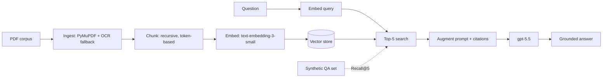

# 06 — Milestone: Enterprise Document Q&A

> Phase 2 · Module 2.1 · Lesson 6 · `[MILESTONE — integrative project]`

This milestone ties together everything in Module 2.1 — **ingestion (02) → chunking (03) →
embeddings (04) → retrieval + generation (01) → evaluation (05)** — into one runnable RAG system, and
proves a chunking change helped by measuring **Recall@5 before and after**.

## 🎯 Goal

Build an **enterprise document Q&A** system over a large PDF corpus (the Road Map target is a 500-page
set) that answers questions **grounded** in the documents, **with citations**, and report a retrieval
metric you can defend.

**Success criteria:**
- Ingests a real (multi-page, possibly messy) PDF corpus into clean chunks with `(source, page)` metadata.
- Answers questions only from retrieved context, citing the source pages.
- Produces a **Recall@5** number on a synthetic QA set, measured **before vs after** a chunking change.

## 🧱 Architecture



> The vector store here is a simple in-memory list so the milestone is self-contained. **Module 2.2**
> swaps it for pgvector/Pinecone/Qdrant with **zero change** to the rest of the pipeline.

## 🛠️ Build it

### Step 1 — Ingest (with an OCR fallback)

```python
# pip install pymupdf pytesseract pillow openai langchain-text-splitters numpy
import fitz, io, pytesseract
from PIL import Image

def load_pdf(path):
    """Return [(text, page_number)], falling back to OCR for scanned pages."""
    out, doc = [], fitz.open(path)
    for n, page in enumerate(doc, start=1):
        text = page.get_text().strip()
        if not text:                                   # no text layer -> scanned page -> OCR
            pix = page.get_pixmap(dpi=300)
            text = pytesseract.image_to_string(Image.open(io.BytesIO(pix.tobytes("png"))))
        out.append((text, n))
    return out
```

### Step 2 — Chunk (carry metadata)

```python
from langchain_text_splitters import RecursiveCharacterTextSplitter

def chunk_pages(pages, chunk_size=500, overlap=75):
    splitter = RecursiveCharacterTextSplitter.from_tiktoken_encoder(
        chunk_size=chunk_size, chunk_overlap=overlap)
    chunks = []
    for text, page_no in pages:
        for piece in splitter.split_text(text):
            chunks.append({"id": len(chunks), "text": piece, "page": page_no})
    return chunks
```

### Step 3 — Embed + store

```python
from openai import OpenAI
import numpy as np
client = OpenAI()

def embed(texts):
    resp = client.embeddings.create(model="text-embedding-3-small", input=texts)
    return [np.array(d.embedding) for d in resp.data]

def build_index(chunks):
    for c, vec in zip(chunks, embed([c["text"] for c in chunks])):
        c["vec"] = vec                                 # store vector alongside text+metadata
    return chunks
```

### Step 4 — Retrieve + generate (grounded, with citations)

```python
def cosine(a, b): return a @ b / (np.linalg.norm(a) * np.linalg.norm(b))

def search(index, question, k=5):
    qv = embed([question])[0]
    ranked = sorted(index, key=lambda c: cosine(qv, c["vec"]), reverse=True)
    return ranked[:k]

def answer(index, question, k=5):
    hits = search(index, question, k)
    context = "\n\n".join(f"[p.{c['page']}] {c['text']}" for c in hits)
    prompt = ("Answer ONLY from the context. Cite page numbers like (p.N). "
              "If the answer isn't present, say you don't know.\n\n"
              f"Context:\n{context}\n\nQuestion: {question}")
    reply = client.responses.create(model="gpt-5.5", input=prompt).output_text
    return reply, [c["page"] for c in hits]
```

### Step 5 — Evaluate (Recall@5, before vs after)

```python
def make_qa(index, n=100):
    import random
    sample = random.sample(index, min(n, len(index)))
    qa = []
    for c in sample:
        q = client.responses.create(
            model="gpt-5.5",
            input=f"Write ONE question answerable ONLY by this text:\n\n{c['text']}").output_text
        qa.append({"q": q, "relevant_id": c["id"]})
    return qa

def recall_at_5(index, qa):
    hits = 0
    for item in qa:
        top = search(index, item["q"], k=5)
        if item["relevant_id"] in {c["id"] for c in top}:
            hits += 1
    return hits / len(qa)

# --- the experiment: does smaller, overlapping chunking improve retrieval? ---
pages = load_pdf("corpus.pdf")
qa = make_qa(build_index(chunk_pages(pages, chunk_size=1000, overlap=0)))   # fixed QA set

idx_a = build_index(chunk_pages(pages, chunk_size=1000, overlap=0))    # baseline: big, no overlap
idx_b = build_index(chunk_pages(pages, chunk_size=500,  overlap=75))   # better: smaller + overlap
print("Recall@5 baseline:", recall_at_5(idx_a, qa))
print("Recall@5 improved:", recall_at_5(idx_b, qa))     # expect this to be higher
```

## 🧪 What to observe

- The **OCR fallback** lets scanned pages contribute instead of silently vanishing (Lesson 02).
- **Smaller, overlapping** chunks should lift Recall@5 over big, non-overlapping ones (Lesson 03) — and
  now you can *prove* it with a number (Lesson 05).
- Answers carry **(p.N) citations**, so a human can verify grounding (Lesson 01).

## 🚀 Extensions (optional)

- Swap the in-memory index for **pgvector** (Module 2.2) — same interface, real persistence.
- Add **hybrid search + reranking** (Module 2.3) and re-measure Recall@5 / MRR.
- Add **metadata filtering** (e.g. only docs from one department) before vector search.
- Wrap it in the **FastAPI streaming gateway** from Phase 1 for a real endpoint.

## 📌 Quick Reference (what this milestone exercises)

```text
02 Ingestion   -> load_pdf() with native text + OCR fallback, keep (source, page)
03 Chunking    -> RecursiveCharacterTextSplitter.from_tiktoken_encoder(500/75)
04 Embeddings  -> text-embedding-3-small, same model for chunks AND queries
01 Retrieve+gen-> top-5 cosine search -> grounded prompt with (p.N) citations
05 Evaluation  -> synthetic QA -> Recall@5 before vs after a chunking change
```

## 🛑 STOP — Self-Check

**Question:** Your Recall@5 is stuck at 0.55. Name two changes from Module 2.1 you'd try **before**
touching the LLM or the prompt — and how you'd know each worked.

<details>
<summary>Answer</summary>

Both are retrieval changes, verified by re-running **Recall@5** on the same QA set:
1. **Chunking (Lesson 03):** smaller chunks (~300–500 tokens) with ~10–15% overlap, or document-aware
   splitting — so relevant text isn't diluted or cut across boundaries.
2. **Embeddings (Lesson 04):** upgrade `text-embedding-3-small` → `text-embedding-3-large` (or a strong
   open-source model), ensuring the **same** model embeds chunks and queries.

If Recall@5 rises, retrieval improved; if it stays flat, the bottleneck is elsewhere (e.g. you'll need
**hybrid search + reranking** from Module 2.3). Only once Recall@5 is high do prompt/generation tweaks
make sense.
</details>
