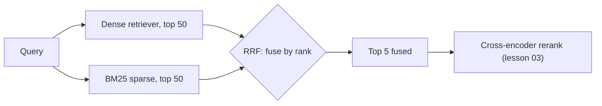

# 02 — Hybrid Search + Reciprocal Rank Fusion (RRF)

> Phase 2 · Module 2.3 · Lesson 2 · `[MUST KNOW — ~72% of RAG JDs]`

## 🗺️ Stage 0 — Concept Map

**The problem first.** You now have **two** retrievers: dense (meaning, Module 2.2) and sparse (BM25,
lesson 01). Each returns its own ranked list. How do you **merge two ranked lists into one**? You can't
just add the scores — cosine similarity runs ~0–1 while BM25 runs ~0–30+, so adding them lets BM25
bulldoze everything. The fix is **Reciprocal Rank Fusion (RRF)**: combine by **rank position**, not raw
score. **Hybrid search** = run both retrievers, then fuse with RRF.

**Where it sits.** The middle of Module 2.3: BM25 (01) + dense (2.2) → **fuse here** → rerank (03). This
is the single highest-leverage retrieval upgrade over naive top-k.

**Why care.** "Hybrid search" appears in ~72% of RAG JDs, and "implement RRF / know the math" is a common
senior interview ask — *because* it shows you understand *why* scores can't just be added.

## 🔑 New Terms (plain English)

- **Hybrid search** — combining keyword (BM25) and vector (dense) retrieval into one result list.
- **Fusion** — merging several ranked lists into a single ranking.
- **Reciprocal Rank Fusion (RRF)** — a fusion method that scores each item by `1 / (k + rank)` summed
  across retrievers — uses **rank**, not score, so scales don't matter.
- **Rank** — an item's *position* in a list (1st, 2nd, 3rd…), not its raw score.
- **`k` (the RRF constant)** — a smoothing number, **conventionally 60**; it softens how much the very top
  ranks dominate.
- **`EnsembleRetriever`** — LangChain's helper that runs several retrievers and fuses them.
  (See the [glossary](../../AI%20Terms%20-%20Plain%20English%20Glossary.md).)

## 🎈 Stage 1 — The Simple Idea (analogy: two judges, one fair vote)

Two expert judges score contestants: one judge marks out of 10, the other out of 1000. You **can't add
their raw marks** — the 1000-judge would decide everything. So instead you use each judge's **ranking**
(who they put 1st, 2nd, 3rd) and give points by **position**. A contestant ranked high by **either** judge
rises; one ranked high by **both** wins. That position-based vote is **RRF**.

**The "Aha!":** fuse by **rank, not score**. Rank is scale-free, so a 0–1 cosine list and a 0–30 BM25 list
combine *fairly* without any score-normalization guesswork.

### 📊 Diagram — hybrid search + RRF



Run **both** retrievers wide, fuse by **rank** (not score), keep the top few — then hand off to reranking.

## ⚙️ Stage 2 — How It Actually Works

**💢 The old/painful way** — try to **add the raw scores**: `0.82 (cosine) + 27.4 (BM25)`. BM25's bigger
numbers dominate, so you bolt on fragile per-retriever weights and re-tune them every time the data
changes. Or you give up and use one retriever, losing the other's strengths. RRF sidesteps all of it by
ignoring scores and using **rank**.

### 2.1 RRF — the formula (and it's tiny)

For each document `d`, sum across every retriever's list:

$$\text{RRF}(d) = \sum_{r \in \text{retrievers}} \frac{1}{k + \text{rank}_r(d)} \quad (k = 60)$$

```python
def reciprocal_rank_fusion(ranked_lists, k=60):
    """ranked_lists = [[dense_ids_in_order], [bm25_ids_in_order], ...]"""
    scores = {}
    for ranking in ranked_lists:
        for rank, doc_id in enumerate(ranking, start=1):     # rank = 1, 2, 3, …
            scores[doc_id] = scores.get(doc_id, 0) + 1.0 / (k + rank)
    return sorted(scores, key=scores.get, reverse=True)      # fused ranking (best first)
```

- A document at **rank 1** in a list contributes `1/61 ≈ 0.0164`; at rank 10, `1/70 ≈ 0.0143`. Small,
  smooth differences — and **no scores anywhere**, so the two lists combine cleanly.
- Appearing in **both** lists stacks two contributions → consensus items rise to the top.

### 2.2 The full hybrid pipeline

```python
# 1) dense (vector) retrieval — top 50 by meaning (Module 2.2)
dense_ids = vector_search(query_embedding, top_k=50)

# 2) sparse (BM25) retrieval — top 50 by exact words (lesson 01)
bm25_ids = bm25.get_top_n(query.split(), doc_ids, n=50)

# 3) fuse the two ranked lists with RRF
fused = reciprocal_rank_fusion([dense_ids, bm25_ids])

# 4) take the top few for the LLM (or pass to a reranker, lesson 03)
top_chunks = fused[:5]
```

> **Why retrieve 50 then keep 5?** Cast a **wide net** with each retriever (recall), then let fusion (and
> reranking, lesson 03) pick the **precise** final few. Retrieve-many → fuse → keep-few is the pattern.

### 2.3 Why `k = 60`, and why rank beats score

- **Rank, not score** → no normalization. A cosine-0.82 and a BM25-27 are incomparable; "rank 3 in each
  list" is perfectly comparable. That's the whole trick.
- **`k = 60`** (the value from the original RRF paper) **dampens** the top ranks: without it, rank-1 would
  utterly dominate; with it, lower-ranked-but-in-both-lists items still get a fair say. 60 is a sensible
  default — you rarely need to tune it.

### 2.4 Built-in hybrid (you don't always hand-roll RRF)

| Option | Notes |
|---|---|
| **From-scratch RRF** (above) | full control; know-the-math; works over any two retrievers |
| **LangChain `EnsembleRetriever`** | runs retrievers + fuses, with per-retriever **weights** |
| **Azure AI Search** | hybrid (BM25 + vector) **+ a semantic ranker** in one query |
| **Weaviate `hybrid(alpha=…)`** | blends keyword↔vector by `alpha` (Module 2.2 lesson 04) |

### 2.5 Fusion method — RRF vs weighted score-fusion (pick one)

- **Reciprocal Rank Fusion (RRF)**
  - **Key features:** rank-based, scale-free, no tuning, robust default.
  - **✅ Use when:** combining retrievers with **incompatible score scales** (dense + BM25) — almost always.
  - **🚫 Avoid when → use weighted scores:** you have *calibrated, comparable* scores and want fine control.
  - **⚠️ Gotcha:** it ignores *how much* better rank 1 was than rank 2 — only the order, which is usually fine.
- **Weighted score fusion** (normalize each list's scores, then `w₁·dense + w₂·sparse`)
  - **Key features:** lets you weight one retriever more; uses score magnitude, not just order.
  - **✅ Use when:** you can normalize scores reliably and want to tilt toward dense *or* sparse.
  - **🚫 Avoid when → use RRF:** scales differ wildly or shift with the data (you'll re-tune forever).
  - **⚠️ Gotcha:** needs per-list normalization and weight tuning — brittle as data changes. (Start with RRF.)

> 🔬 **Under the hood:** RRF works because `1/(k+rank)` gives a **smooth, bounded** weight that decreases
> with position — so being near the top of *any* list helps, and being near the top of *several* lists
> helps more (consensus). Because it only reads **positions**, it's invariant to each retriever's score
> scale — which is exactly why you don't normalize anything. It's a *fusion* step, not a *reordering*
> step: it merges lists but doesn't re-judge relevance — that's the reranker's job (lesson 03).

## 🚀 Stage 3 — In Practice / Why It Matters

Hybrid search is the standard production retriever: dense catches paraphrases, BM25 catches exact terms,
and RRF fuses them with zero score-tuning. It typically lifts retrieval quality (Recall@K, lesson 2.1.05)
well above either retriever alone — measurably, which is how you justify it. The Module 2.3 milestone
builds exactly this: **BM25 + dense + RRF + reranking**, and compares precision@5 against pure vector
search.

## ⚖️ Variations & When to Use

| Decision | Options | Use which |
|---|---|---|
| **Fusion method** | **RRF** vs weighted score-fusion | **RRF** by default (scale-free, no tuning) · weighted only with calibrated scores |
| **Implementation** | from-scratch RRF vs `EnsembleRetriever` vs Azure AI Search vs Weaviate | from-scratch to learn/control · built-ins for convenience at scale |
| **Then what?** | fuse only vs **fuse → rerank** | add a **reranker** (lesson 03) when you need top precision |

> Decision rule: **dense + BM25 + RRF is the default hybrid recipe; reach for weighted fusion only with calibrated scores.**

## 🐛 Common Errors & Fixes

| What you see | Cause | Fix |
|---|---|---|
| One retriever dominates results | Added raw scores (different scales) | Use **RRF** (rank-based), not score sums |
| Hybrid barely beats dense | Retrieved too few before fusing | Retrieve top-**50** from each, then fuse and keep top-5 |
| Duplicate docs in fused list | IDs differ across retrievers | Use a **stable shared id** per chunk in both lists |
| RRF result order looks off | `k` or ranks wrong | Use 1-based ranks and `k=60` (the standard) |

## 📌 Quick Reference (cheat-sheet)

```python
def rrf(ranked_lists, k=60):
    s = {}
    for lst in ranked_lists:
        for rank, doc_id in enumerate(lst, start=1):
            s[doc_id] = s.get(doc_id, 0) + 1/(k + rank)
    return sorted(s, key=s.get, reverse=True)

fused = rrf([dense_top50, bm25_top50])[:5]      # dense + BM25 -> one ranking -> keep 5
```
- **Hybrid = dense + BM25, fused by RRF.** Fuse by **rank** (`1/(k+rank)`, k=60), never by raw score.
- Retrieve **wide** (top-50 each) → fuse → keep **few** (top-5) → optionally **rerank** (lesson 03).

## 🛑 STOP — Self-Check

A teammate fuses dense and BM25 results by **adding their scores** (`cosine + bm25`). Results are dominated
by BM25 and tuning weights is a nightmare. What's the underlying problem, and how does RRF fix it without
any weights?

<details>
<summary>Answer</summary>

The scores are on **incompatible scales** — cosine ≈ 0–1, BM25 ≈ 0–30+ — so adding them lets BM25's larger
numbers dominate, and any fixed weights break whenever the data (and thus the score ranges) shift. **RRF**
fixes it by ignoring scores entirely and fusing by **rank**: each item scores `1/(k + rank)` (k=60) summed
across the lists. Rank is **scale-free**, so "3rd in each list" combines fairly with no normalization and
no weights — items ranked highly by **either** retriever rise, and **consensus** items rise most.
</details>
