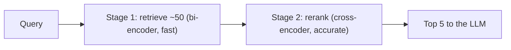

# 03 — Cross-Encoder Reranking

> Phase 2 · Module 2.3 · Lesson 3 · `[MUST KNOW — ~65% of RAG JDs]`

> 🔑 Reranker model names (`rerank-v3.5`, `bge-reranker-v2-m3`) are 2026 examples — check the live docs.

## 🗺️ Stage 0 — Concept Map

**The problem first.** Retrieval (dense, BM25, or hybrid) is **fast but rough**. To stay fast it uses a
**bi-encoder**: it embeds the query and every chunk *separately, ahead of time*, then compares vectors.
That's why you can search millions in milliseconds — but it's only an *approximation* of relevance, so the
genuinely best chunk often sits at rank 8 or 12, not rank 1. A **reranker** fixes the *order*: it reads the
query **together with** each candidate and scores true relevance — far more accurate, but too slow to run
over millions. The answer is **two-stage retrieval**: retrieve ~50 fast, then **rerank** to the best 5.

**Where it sits.** The last retrieval step in Module 2.3: BM25 (01) + dense (2.2) → fuse (02) → **rerank
here** → feed the top few to the LLM. It's the cheapest big precision win after hybrid search.

**Why care.** Reranking is in ~65% of RAG JDs, and "retrieve-then-rerank" is a standard interview answer
for "how do you improve RAG precision?".

## 🔑 New Terms (plain English)

- **Reranking** — a second, more accurate pass that **re-orders** the retrieved candidates by relevance.
- **Bi-encoder** — encodes query and document **separately** into vectors, then compares. Fast,
  precomputable — used for **retrieval**.
- **Cross-encoder** — reads the query and document **together** in one pass and outputs a relevance score.
  Accurate, slow — used for **reranking**.
- **Two-stage retrieval** — stage 1 retrieve many (bi-encoder), stage 2 rerank the shortlist (cross-encoder).
- **Relevance score** — the reranker's judgment of how well a chunk answers the query.
- **Latency budget** — how much extra time you can spend per query (reranking adds ~100–400 ms).
- **Cohere Rerank** — a hosted reranking API; **`bge-reranker`** — an open-source cross-encoder you self-host.
  (See the [glossary](../../AI%20Terms%20-%20Plain%20English%20Glossary.md).)

## 🎈 Stage 1 — The Simple Idea (analogy: a recruiter shortlisting CVs)

A recruiter facing **1,000 CVs** doesn't read them all. **Stage 1 (retrieval):** skim by keywords/skills in
seconds and pull a **shortlist of 50** — fast, rough, high-recall. **Stage 2 (rerank):** now actually
**read** those 50 carefully against the job description and rank the **top 5** — slow, but you only do it
for 50, not 1,000. Reading all 1,000 closely is impossible; reading the shortlisted 50 is exactly worth it.

**The "Aha!":** you can't afford the accurate-but-slow method on everything, so you use the fast method to
**shortlist**, then spend the accurate method only on the shortlist. That's retrieve → rerank.

### 📊 Diagram — two-stage retrieval



Fast-but-rough shortlists the candidates; accurate-but-slow only ever runs on those ~50 — the best of both.

## ⚙️ Stage 2 — How It Actually Works

**💢 The old/painful way** — dump all 50 retrieved chunks straight into the LLM prompt. It's **noisy**
(many irrelevant chunks), **expensive** (50× the tokens), and triggers **lost-in-the-middle** (Phase 1) so
the model misses the good chunk buried at position 30. Or you trust the bi-encoder's top-5 — which is only
an approximation and often wrong about the *best* one.

### 2.1 Bi-encoder vs cross-encoder (why two different models)

- **Bi-encoder (retrieval)** — embeds query and each chunk **independently**, compares vectors.
  - **Key features:** chunks are embedded **once, offline**; queries embed in milliseconds; scales to millions.
  - **✅ Use when:** **stage 1** — fast first-pass retrieval over the whole corpus.
  - **🚫 Avoid relying on its order → add a cross-encoder:** you need the *precise* best few.
  - **⚠️ Gotcha:** comparing two separate vectors is only an *approximation* of true relevance.
- **Cross-encoder (reranking)** — reads `(query, chunk)` **together** in one transformer pass → a relevance score.
  - **Key features:** sees the query and chunk *interacting*, so it judges relevance far more accurately.
  - **✅ Use when:** **stage 2** — reorder a small shortlist (e.g. 50 candidates) into the true best.
  - **🚫 Avoid when → use a bi-encoder:** scoring the *whole* corpus (it can't precompute — far too slow).
  - **⚠️ Gotcha:** cost grows with the number of candidates × their length — keep the shortlist small.

### 2.2 The two-stage pattern

```python
# Stage 1 — retrieve a WIDE shortlist (fast bi-encoder / hybrid, lessons 01–02)
candidates = hybrid_search(query, top_k=50)        # 50 chunks, high recall, rough order

# Stage 2 — rerank to the PRECISE best few (slow cross-encoder)
top5 = rerank(query, candidates, top_n=5)          # read each (query, chunk) together, reorder
```

### 2.3 Reranking with a hosted API (Cohere Rerank)

```python
import cohere
co = cohere.Client(api_key="...")

reranked = co.rerank(
    model="rerank-v3.5",
    query="how many vacation days do new staff get?",
    documents=[c.text for c in candidates],        # the 50 shortlisted chunks
    top_n=5,                                        # return the best 5
)
best = [candidates[r.index] for r in reranked.results]   # r.index, r.relevance_score
```

### 2.4 Reranking with an open-source cross-encoder (self-host)

```python
# pip install sentence-transformers
from sentence_transformers import CrossEncoder
reranker = CrossEncoder("BAAI/bge-reranker-v2-m3")          # runs locally (GPU helps)

pairs = [(query, c.text) for c in candidates]              # query paired with EACH candidate
scores = reranker.predict(pairs)                            # one relevance score per pair
top5 = [c for _, c in sorted(zip(scores, candidates), key=lambda x: x[0], reverse=True)][:5]
```

**Cohere (managed) vs open-source (self-host) — pick one:**
- **Cohere Rerank** (hosted API)
  - **✅ Use when:** you want top quality with zero ops — just call the API.
  - **🚫 Avoid when → self-host:** data can't leave your infrastructure, or per-call cost at scale hurts.
  - **⚠️ Gotcha:** every rerank is a paid network call — adds latency and cost per query.
- **Open-source cross-encoder** (`bge-reranker`, `ms-marco-MiniLM`)
  - **✅ Use when:** privacy, cost at scale, or offline — you run it on your own GPU/CPU.
  - **🚫 Avoid when → use Cohere:** you have no GPU and don't want to host a model.
  - **⚠️ Gotcha:** you own the serving, scaling, and latency (a GPU makes it practical).

### 2.5 The latency budget — when reranking is worth it

Reranking adds **~100–400 ms** per query. **Inline decision:** add it when **precision matters** (you feed
only the top 3–5 chunks to the LLM, so they'd better be the *right* ones) or when retrieval is noisy; skip
it for **latency-critical** paths or when hybrid retrieval is already precise enough — and **measure**
(Recall@K/precision, lesson 2.1.05) to confirm the lift is worth the milliseconds.

> 🔬 **Under the hood:** a **bi-encoder** turns query and document into vectors *independently*, so their
> embeddings can be **precomputed** and compared with a cheap dot product — fast, but the two never "see"
> each other. A **cross-encoder** concatenates `query [SEP] document` and runs the **full transformer
> attention across both**, so every query word can attend to every document word — that interaction is why
> it judges relevance so much better, and *also* why it can't be precomputed (the score depends on the
> *pair*). That cost is only affordable on a **small shortlist**, which is the whole reason for two stages.

## 🚀 Stage 3 — In Practice / Why It Matters

Retrieve-then-rerank is the standard production recipe for precision: cast a wide net (hybrid, top-50),
then let a cross-encoder pick the true best 5 for the LLM. It's often the **single biggest quality jump**
after hybrid search, for a small latency cost — and it directly improves the chunks the LLM sees, reducing
hallucination and lost-in-the-middle. The Module 2.3 milestone measures precision@5 **with vs without**
reranking to prove the lift.

## ⚖️ Variations & When to Use

| Decision | Options | Use which |
|---|---|---|
| **Rerank or not** | hybrid only vs hybrid **+ rerank** | **+ rerank** when you feed few chunks / need precision · skip for latency-critical paths |
| **Reranker** | **Cohere Rerank** (managed) vs open-source cross-encoder | Cohere for zero-ops quality · OSS (`bge-reranker`) for privacy/cost/offline |
| **Candidates (N)** | rerank top-20 vs top-50 vs top-100 | more candidates = better recall but slower/costlier — **top-50 → keep 5** is a good default |

> Decision rule: **retrieve ~50 (hybrid) → rerank to ~5 (cross-encoder) when precision matters; pick Cohere vs OSS by ops/privacy/cost.**

## 🐛 Common Errors & Fixes

| What you see | Cause | Fix |
|---|---|---|
| Answers cite the wrong chunk | Trusted bi-encoder order | Add a **cross-encoder rerank** stage |
| Reranking is too slow | Reranking too many candidates | Shrink the shortlist (top-50, not top-500) |
| No quality gain from reranking | Stage-1 recall was already poor | Fix retrieval first (hybrid, lesson 02) — rerank can't add what wasn't retrieved |
| Used a bi-encoder to "rerank" | Same approximation as retrieval | Rerank with a **cross-encoder** (reads pairs together) |
| Huge LLM bill | Fed all 50 chunks to the LLM | Rerank, then feed only the top 3–5 |

## 📌 Quick Reference (cheat-sheet)

```python
# Two-stage: retrieve wide (bi-encoder/hybrid) -> rerank narrow (cross-encoder)
candidates = hybrid_search(query, top_k=50)
# managed:
reranked = co.rerank(model="rerank-v3.5", query=query, documents=[c.text for c in candidates], top_n=5)
# open-source:
scores = CrossEncoder("BAAI/bge-reranker-v2-m3").predict([(query, c.text) for c in candidates])
```
- **Bi-encoder = retrieve (fast, separate). Cross-encoder = rerank (accurate, together).**
- **Retrieve 50 → rerank to 5.** Adds ~100–400 ms — worth it when you feed the LLM only the top few.

## 🛑 STOP — Self-Check

Your retrieval recall is good (Recall@50 = 0.95 — the right chunk is almost always *somewhere* in the top
50), but final answers are still mediocre because the right chunk is usually ranked ~15th and gets buried.
Which stage fixes this, what kind of model does it use, and why can't you just run that model over the
whole corpus?

<details>
<summary>Answer</summary>

Add a **reranking** stage using a **cross-encoder**. It reads each `(query, chunk)` pair **together** and
scores true relevance, so it promotes that 15th-ranked-but-actually-best chunk into the top few you feed
the LLM. You **can't** run it over the whole corpus because a cross-encoder can't be precomputed — its
score depends on the query+chunk **pair**, so it would have to score *every* chunk *per query*, which is far
too slow for millions. That's why you use the **fast bi-encoder to shortlist ~50**, then spend the
**accurate cross-encoder only on those 50** (two-stage retrieval).
</details>
