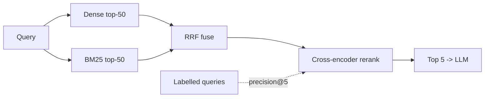

# 06 — Milestone: Hybrid Enterprise Search

> Phase 2 · Module 2.3 · Lesson 6 · `[MILESTONE — integrative project]`

This milestone ties Module 2.3 together: **BM25 (01) + dense (Module 2.2) → RRF fusion (02) →
cross-encoder reranking (03)** — and proves it beats naive vector search by measuring **precision@5**.

## 🎯 Goal

Build a **hybrid enterprise search** pipeline and show, with a number, that **hybrid + rerank** retrieves
more relevant chunks than **pure vector search**.

**Success criteria:**
- Runs **both** retrievers (BM25 + dense) and **fuses** them with RRF.
- **Reranks** the fused shortlist with a cross-encoder.
- Reports **precision@5** for *pure vector* vs *hybrid+rerank* on a small labelled query set.

## 🧱 Architecture



## 🛠️ Build it

### Step 1 — The two retrievers

```python
# pip install rank_bm25 sentence-transformers numpy
from rank_bm25 import BM25Okapi
import numpy as np

# Dense: reuse your embeddings + vector store (Module 2.2). Here, an in-memory stand-in:
def dense_top_n(query_vec, index, n=50):
    def cos(a, b): return a @ b / (np.linalg.norm(a) * np.linalg.norm(b))
    return [doc_id for doc_id, _ in
            sorted(((i, cos(query_vec, v)) for i, v in index.items()),
                   key=lambda x: x[1], reverse=True)[:n]]

# Sparse: BM25 over the same chunks (lesson 01)
bm25 = BM25Okapi([doc_text[i].lower().split() for i in doc_ids])
def bm25_top_n(query, n=50):
    ranked = sorted(zip(doc_ids, bm25.get_scores(query.lower().split())),
                    key=lambda x: x[1], reverse=True)
    return [doc_id for doc_id, _ in ranked[:n]]
```

### Step 2 — Fuse with RRF (lesson 02)

```python
def rrf(ranked_lists, k=60):
    s = {}
    for lst in ranked_lists:
        for rank, doc_id in enumerate(lst, start=1):
            s[doc_id] = s.get(doc_id, 0) + 1 / (k + rank)
    return sorted(s, key=s.get, reverse=True)
```

### Step 3 — Rerank with a cross-encoder (lesson 03)

```python
from sentence_transformers import CrossEncoder
reranker = CrossEncoder("BAAI/bge-reranker-v2-m3")          # or Cohere co.rerank(...)

def rerank(query, candidate_ids, top_n=5):
    pairs = [(query, doc_text[i]) for i in candidate_ids]
    scores = reranker.predict(pairs)
    return [i for i, _ in sorted(zip(candidate_ids, scores), key=lambda x: x[1], reverse=True)][:top_n]
```

### Step 4 — The full hybrid+rerank search

```python
def hybrid_search(query, query_vec):
    dense = dense_top_n(query_vec, index, n=50)
    sparse = bm25_top_n(query, n=50)
    fused = rrf([dense, sparse])[:50]          # merge the two ranked lists
    return rerank(query, fused, top_n=5)       # cross-encoder picks the best 5
```

### Step 5 — Evaluate: precision@5, pure-vector vs hybrid+rerank

```python
def precision_at_5(results, relevant_ids):
    return len(set(results[:5]) & set(relevant_ids)) / 5

# eval_set = [(query, query_vec, [relevant_ids]), ...]   # a small hand-labelled set
def mean_p5(search_fn):
    return sum(precision_at_5(search_fn(q, qv), rel) for q, qv, rel in eval_set) / len(eval_set)

print("pure vector   p@5:", mean_p5(lambda q, qv, *_: dense_top_n(qv, index, n=5)))
print("hybrid+rerank p@5:", mean_p5(lambda q, qv, *_: hybrid_search(q, qv)))   # expect higher
```

## 🧪 What to observe

- **Hybrid** beats pure-vector most on queries with **exact terms** (codes, IDs, names) that dense missed.
- **Reranking** lifts precision again by promoting the genuinely-best chunk into the top 5.
- The gap is a **number** (precision@5) — exactly how you justify the extra complexity to a team.

## 🚀 Extensions (optional)

- Swap the in-memory dense store for **pgvector / Pinecone / Qdrant** (Module 2.2) — same interface.
- Swap the OSS reranker for **Cohere Rerank** and compare quality/latency.
- Add **metadata filtering** (department, date) before fusion.
- Add **contextual compression** (lesson 04) before the LLM and watch token cost drop.

## 📌 Quick Reference (what this exercises)

```text
01 BM25       -> sparse top-50 (exact words)
2.2 vector    -> dense top-50 (meaning)
02 RRF        -> fuse the two ranked lists (1/(k+rank), k=60)
03 rerank     -> cross-encoder picks the precise top-5
eval          -> precision@5: pure-vector vs hybrid+rerank
```

## 🛑 STOP — Self-Check

Your **hybrid+rerank** precision@5 is only marginally better than pure vector search. Name the two stages
you'd inspect first to find the lift you expected — and the question to ask at each.

<details>
<summary>Answer</summary>

1. **Fusion (RRF):** are you retrieving a **wide enough** shortlist from *each* retriever (top-50, not
   top-5) before fusing, and do both lists use a **shared chunk id**? If BM25 contributes almost nothing,
   check tokenization — the exact-match wins may not be surfacing.
2. **Reranking:** is the cross-encoder actually re-ordering the fused list, and is stage-1 **recall** good
   (is the right chunk even in the top-50)? A reranker can only promote what retrieval already found — if
   Recall@50 is low, fix retrieval first (hybrid), because reranking can't add a chunk that was never
   retrieved.

(Measure each stage separately — Recall@50 for retrieval/fusion, precision@5 for reranking — so you know
*which* stage is the bottleneck.)
</details>
