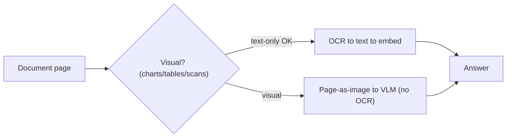

# 01 — Vision-Language Models for Documents

> Phase 2 · Module 2.4 · Lesson 1 · `[MUST KNOW — ~62% of RAG JDs]`

> 🔑 Vision model names (GPT-5.5, GPT-4o, Claude, Gemini) are 2026 examples — check the live docs.

## 🗺️ Stage 0 — Concept Map

**The problem first.** Everything in Module 2.1–2.3 assumed you could extract **clean text** from a
document. But a huge share of enterprise documents are **visual**: scanned pages, multi-column layouts,
**financial tables**, charts and diagrams, forms, and handwritten notes. Run OCR over those and you get
**garbled text** — and a bar chart becomes meaningless number-soup. **Vision-Language Models (VLMs)** —
GPT-5.5 / GPT-4o vision, Claude vision, Gemini — read the **page image itself**, understanding layout,
tables, and charts the way a person would, **bypassing brittle OCR**.

**Where it sits.** This is **multimodal RAG**: when the answer lives in a *picture* (a chart, a scanned
table, a diagram), you retrieve and reason over **images**, not just extracted text.

**Why care.** Vision document understanding is in ~62% of RAG JDs — finance, insurance, legal, and
healthcare are full of visual documents that text-only RAG simply can't read.

## 🔑 New Terms (plain English)

- **Multimodal** — handling more than one kind of input (here: **text + images**).
- **Vision-Language Model (VLM)** — an LLM that can also "see" images and reason about them.
- **Page-as-image** — treating a document page as a picture and feeding it to a VLM (no OCR).
- **Vision input** — an image passed to the model, usually as a **base64** string or a URL.
- **base64** — a way to encode an image's bytes as text so it fits in a JSON request.
- **Azure AI Document Intelligence** — Microsoft's enterprise OCR **+ layout** service (text, tables,
  key-value pairs, reading order).
- **Document understanding** — extracting meaning/structure from a document, not just its raw characters.
  (See the [glossary](../../AI%20Terms%20-%20Plain%20English%20Glossary.md).)

## 🎈 Stage 1 — The Simple Idea (analogy: showing vs dictating)

Old pipeline: a **blind expert** who needs everything **dictated** — so you OCR the page into text and read
it out. On a clean letter that's fine; on a **chart** or a **two-column scanned table**, the dictation
comes out as gibberish ("12 45 ▮ revenue ▮ 2024 Q3…") and the expert is lost. A **VLM** is a **sighted
expert**: you just **show** them the page. They see the bars, the columns, the arrows, the handwriting —
and answer.

**The "Aha!":** for visual documents, stop forcing the page through OCR-into-text. **Show the model the
picture** and let it read layout, tables, and charts directly.

### 📊 Diagram — text path vs vision path



Clean text pages can still go the OCR route; for charts, scanned tables, and multi-column pages, **show the VLM the image**.

## ⚙️ Stage 2 — How It Actually Works

**💢 The old/painful way** — OCR every page into text and hope. On scanned, multi-column, or chart-heavy
pages, OCR scrambles reading order and flattens tables, so your RAG ingests nonsense — and no embedding or
reranker can rescue text that was broken at the door.

### 2.1 Send a page image to a VLM

```python
# OpenAI (Responses API) — a page image + a question, in one call (Module 1.2 lesson 01):
from openai import OpenAI
client = OpenAI()

resp = client.responses.create(
    model="gpt-5.5",
    input=[{"role": "user", "content": [
        {"type": "input_text",  "text": "What was Q3 revenue in this chart?"},
        {"type": "input_image", "image_url": "data:image/png;base64,<…page image…>"},
    ]}],
)
print(resp.output_text)        # the model READ the chart, no OCR
```

```python
# Anthropic (Claude) — same idea, image as a content block (Module 1.2 lesson 02):
msg = client.messages.create(model="claude-opus-4-6", max_tokens=512,
    messages=[{"role": "user", "content": [
        {"type": "text", "text": "Extract the table from this page as JSON."},
        {"type": "image", "source": {"type": "base64", "media_type": "image/png", "data": b64}},
    ]}])
```

### 2.2 Document understanding = vision + structured outputs

Combine vision with **structured outputs** (Module 1.3) to pull clean data straight off a page image:

```python
# Ask the VLM to fill a Pydantic schema from a scanned invoice image:
class Invoice(BaseModel):
    vendor: str
    total: float
    line_items: list[LineItem]
# -> instructor / response_format + the image -> a validated Invoice, no OCR step
```

This reads charts, totals, and tables a text pipeline would mangle.

### 2.3 Azure AI Document Intelligence (the structured enterprise route)

For high-volume forms/invoices, Azure's **layout API** returns text **+ tables + key-value pairs + reading
order** as structured data — a managed, compliant alternative to raw VLM calls (it reappeared from Phase 1
and Module 2.1's OCR lesson).

```python
# conceptual:
client.begin_analyze_document("prebuilt-layout", body=pdf_bytes)   # -> structured tables/fields
```

### 2.4 Gemini — native long-context PDF understanding

Gemini can ingest **whole PDFs** (many pages of mixed text + images) in one long-context multimodal call —
useful when you'd rather hand over a document than pre-chunk it.

### 2.5 Two ways to do multimodal RAG

- **VLM-to-text (index time):** run pages/figures through a VLM **once** to produce rich text descriptions
  (a chart → "bar chart: Q3 revenue $4.2M, up 12%…"), then do **normal text RAG** over those descriptions.
  - **✅ Use when:** you want the cheap, familiar text-RAG pipeline and can pay the one-time VLM pass.
  - **🚫 Avoid when → use multimodal retrieval:** fine visual detail matters and a text summary loses it.
  - **⚠️ Gotcha:** the description is only as good as the prompt — and detail not described is lost forever.
- **Multimodal retrieval (query time):** retrieve the relevant **page images** and feed the *images* to a
  VLM when answering.
  - **✅ Use when:** answers depend on seeing the actual layout/chart (finance, diagrams).
  - **🚫 Avoid when → use VLM-to-text:** cost/latency-sensitive, or pages are mostly plain text.
  - **⚠️ Gotcha:** sending images every query costs more tokens and needs an image-capable retriever (see ColPali, lesson 02).

> 🔬 **Under the hood:** a VLM splits an image into a grid of **patches**, encodes each patch into the
> *same kind of token* the model uses for words, and runs attention **across image patches and text
> together** — so a question word can "look at" the relevant part of the chart. That shared token space is
> why a VLM can read layout and figures that OCR (which only transcribes characters) destroys.

## 🚀 Stage 3 — In Practice / Why It Matters

Whole industries run on visual documents — financial statements, insurance forms, medical records, legal
filings, engineering diagrams. Text-only RAG silently fails on them; VLMs unlock them. The pragmatic
pattern is a **router**: clean digital text → normal text RAG; scanned/visual/chart-heavy → VLM (or Azure
Document Intelligence). The Module 2.4 milestone builds a **financial-report analyser** that answers
questions over document *page images* with GPT vision.

## ⚖️ Variations & When to Use

| Decision | Options | Use which |
|---|---|---|
| **Read the page** | **VLM (page-as-image)** vs OCR-then-text | **VLM** for scanned/complex/chart pages · OCR-to-text only for clean digital text (cheaper) |
| **Provider** | GPT vision vs Claude vision vs Gemini vs Azure DI | GPT/Claude for general vision Q&A · Gemini for whole-PDF long context · **Azure DI** for high-volume forms/tables |
| **RAG style** | VLM-to-text (index) vs multimodal retrieval (query) | VLM-to-text for cheap familiar pipeline · multimodal retrieval when visual detail matters |

> Decision rule: **clean text → text RAG; visual/scanned/chart documents → a VLM (or Azure Document Intelligence for high-volume forms).**

## 🐛 Common Errors & Fixes

| What you see | Cause | Fix |
|---|---|---|
| Charts/tables come out as gibberish | OCR-then-text on visual pages | Send the **page image to a VLM** instead |
| VLM answer invents numbers | Image too low-res to read | Rasterise at higher DPI; crop to the relevant region |
| Huge bill on a big PDF corpus | Sending every page image every query | **VLM-to-text at index time**, then text RAG |
| Forms parsed inconsistently | General VLM on structured forms | Use **Azure Document Intelligence** (layout/fields) |
| Image rejected by the API | Wrong encoding/format | Send valid **base64** with the right `media_type` |

## 📌 Quick Reference (cheat-sheet)

```python
# Show a page image to a VLM (OpenAI Responses API):
client.responses.create(model="gpt-5.5", input=[{"role":"user","content":[
    {"type":"input_text","text":"Read the table on this page."},
    {"type":"input_image","image_url":"data:image/png;base64,<page>"}]}])
```
- **VLM = read the page image directly** (layout, charts, tables) — bypass brittle OCR.
- **VLM-to-text** (index once → text RAG) vs **multimodal retrieval** (feed images at query time).
- High-volume forms/tables → **Azure AI Document Intelligence**. Combine vision + **structured outputs** to extract clean data.

## 🛑 STOP — Self-Check

You're building RAG over **scanned annual reports** full of financial **charts and tables**. Your text
pipeline (OCR → chunk → embed) gives terrible answers on anything chart-related. What's the fix, and what's
one way to keep the *cost* down at scale?

<details>
<summary>Answer</summary>

OCR transcribes characters but **destroys** charts and complex table layouts, so the pipeline ingests
nonsense. The fix is a **Vision-Language Model**: feed the **page image** to GPT/Claude vision (or use
**Azure AI Document Intelligence** for structured tables/fields), so the model *sees* the chart and reads
it. To control **cost** at scale, do **VLM-to-text at index time** — run each visual page through the VLM
**once** to produce a rich text description ("bar chart: Q3 revenue $4.2M, +12%…"), then run normal,
cheap **text RAG** over those descriptions instead of sending page images on every query.
</details>
