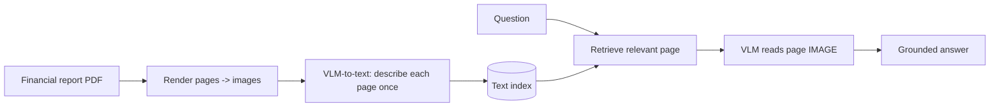

# 04 — Milestone: Financial Report Analyser (Vision)

> Phase 2 · Module 2.4 · Lesson 4 · `[MILESTONE — integrative project]`

This milestone ties Module 2.4 together: turn a **visual** PDF (a financial report full of charts and
tables) into a question-answering system using a **Vision-Language Model** (lesson 01) — the path text RAG
can't take. (Full ColPali retrieval, lesson 02, is the full-track extension.)

## 🎯 Goal

Answer questions over a **chart/table-heavy financial report** by sending **page images** to a VLM — and
show it works where an OCR-text pipeline fails.

**Success criteria:**
- Renders PDF pages to **images** (no reliance on OCR).
- Answers chart/table questions by sending the relevant **page image(s)** to a VLM.
- (Stretch) Indexes pages cheaply via **VLM-to-text**, retrieves the right page, then answers.

## 🧱 Architecture



## 🛠️ Build it

### Step 1 — PDF pages → images

```python
# pip install pymupdf openai
import fitz, base64

def page_images(path, dpi=200):
    doc = fitz.open(path)
    for n, page in enumerate(doc, start=1):
        png = page.get_pixmap(dpi=dpi).tobytes("png")        # render the page as an image
        yield n, base64.b64encode(png).decode()              # base64 for the API
```

### Step 2 — Ask a VLM about a page image (the core move)

```python
from openai import OpenAI
client = OpenAI()

def ask_page(b64_png, question):
    resp = client.responses.create(
        model="gpt-5.5",
        input=[{"role": "user", "content": [
            {"type": "input_text",  "text": f"Answer from this page only. {question}"},
            {"type": "input_image", "image_url": f"data:image/png;base64,{b64_png}"},
        ]}],
    )
    return resp.output_text                                   # reads charts/tables directly
```

### Step 3 — Cheap indexing via VLM-to-text (so you don't send every page every query)

```python
def describe_page(b64_png):
    return ask_page(b64_png, "Describe this page in detail: all numbers, chart values, and table data.")

index = []                                                   # (page_no, b64, description)
for n, b64 in page_images("annual_report.pdf"):
    index.append({"page": n, "b64": b64, "desc": describe_page(b64)})   # one-time VLM pass
# embed the `desc` fields (Module 2.1.04) into a vector store (Module 2.2) for retrieval
```

### Step 4 — Answer a question (retrieve the page, then SEE it)

```python
def answer(question, query_vec):
    page = retrieve_top_page(query_vec, index)               # text RAG over the descriptions
    return ask_page(page["b64"], question)                   # VLM reads the actual page image
```

## 🧪 What to observe

- The VLM reads **charts and tables** an OCR pipeline turns to gibberish — that's the whole point.
- **VLM-to-text indexing** keeps cost down: you pay the vision pass **once per page**, then retrieve cheaply
  and only send the **one** relevant page image at answer time.
- Try a question whose answer is **only in a chart** (e.g. "what was the Q3 revenue spike?") — text RAG
  can't answer it; the vision path can.

## 🚀 Extensions (optional)

- Swap retrieval for **ColPali** (lesson 02) — image-native page retrieval, no OCR/description step.
- Add **structured outputs** (Module 1.3) to extract a clean `Invoice`/`Financials` object per page.
- Route **clean digital pages → text RAG** and **visual pages → vision** (a hybrid ingestion router).
- Use **Azure AI Document Intelligence** for high-volume tables/forms instead of a general VLM.

## 📌 Quick Reference (what this exercises)

```text
01 VLMs            -> send page IMAGES to GPT/Claude vision (read charts/tables, no OCR)
VLM-to-text        -> describe each page ONCE -> embed -> retrieve cheaply (cost control)
02 ColPali (ext.)  -> image-native page retrieval
1.3 structured out -> extract clean typed data from a page image
```

## 🛑 STOP — Self-Check

Sending **every page image** of a 200-page report to the VLM on **every** question is accurate but slow and
expensive. Describe the indexing change that keeps the accuracy while cutting cost, and why it works.

<details>
<summary>Answer</summary>

Use **VLM-to-text indexing**: run each page through the VLM **once** (offline) to produce a rich text
**description** of its charts/tables/numbers, embed those descriptions, and store them (Module 2.2). At
query time you do cheap **text retrieval** to find the **one** relevant page, then send **only that page's
image** to the VLM to answer. This works because the expensive vision pass happens **once per page** instead
of **once per page per query**, while the final answer still comes from the model *seeing the real page* —
so you keep vision accuracy at a fraction of the cost.
</details>
